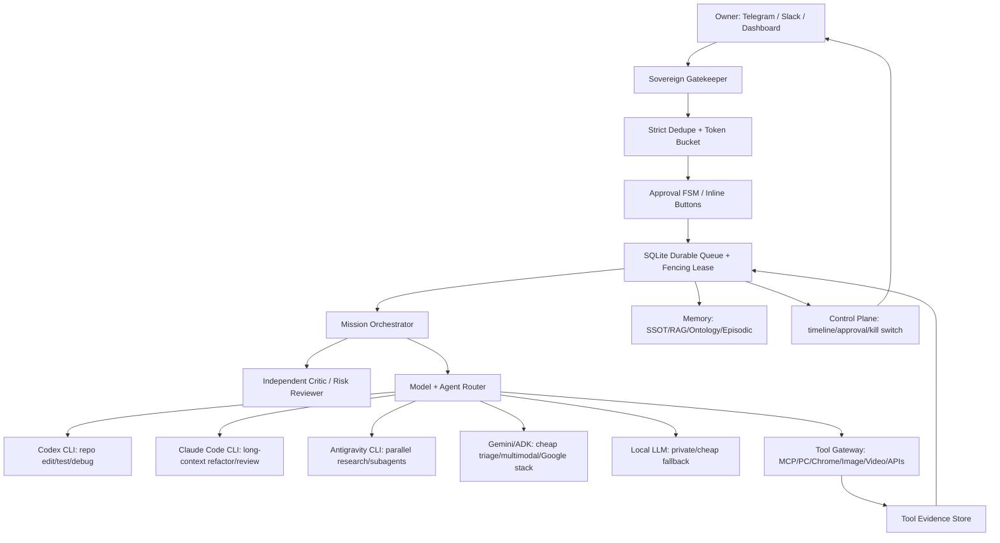
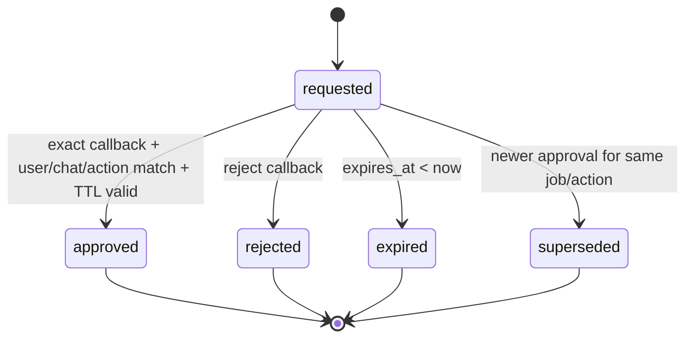
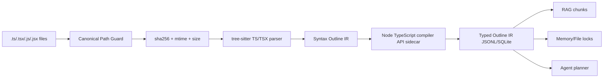

# Jarvis Sovereign Agent Architecture v1

> 작성일: 2026-05-24 KST  
> 대상: `desktop-home` 중심 Neo Genesis / Sora / Codex / Claude Code / Antigravity / local tools  
> 상태: 연구 및 설계안. 아직 `.agent/` SSOT로 승격하지 않음.

## 0. 결론

나만의 Jarvis/Vision은 "강한 LLM 하나"가 아니라, **단일 명령 게이트 + 결정론적 정책 엔진 + durable queue + 각 agent/CLI의 장점별 실행 어댑터 + 증거 기반 메모리**로 설계해야 한다.

현재 Neo Genesis에는 이미 좋은 기반이 있다.

- `Telegram -> Redis queue -> Brain Worker -> Gemini/Codex backend -> Telegram` 경로
- `src/core/governance/execution_gate.py`의 G0-G5 실행 게이트
- `src/core/security/command_governor.py`의 warn-then-obey 초안
- `src/core/codex_runtime/runner.py`의 Codex CLI 실행 경로
- `.agent/registries/callable_tools.json`의 callable tool registry
- `sora_conversations`/Supabase, RAG v1/v2, ontology scripts, dashboard control-plane 기반

하지만 Jarvis급 운영체계로 가려면 다음 4가지를 P0로 바꿔야 한다.

1. **Ingress 무결성**: Telegram/Slack 진입점은 LLM보다 앞에서 dedupe, token bucket, strict approval FSM을 끝내야 한다.
2. **실행 진실성**: LLM 답변은 "실행했습니다"를 말할 권한이 없다. 실행 성공은 `tool_runs.exit_code=0`, stdout/stderr hash, artifact path가 있을 때만 report 가능하다.
3. **동시성 진실성**: Redis/pubsub는 신호용으로 두고, 작업 상태와 승인/lease/audit은 SQLite WAL + fencing token ledger로 승격해야 한다.
4. **지식/컨텍스트 지속성**: 대화 전체를 한 context에 넣는 방식은 실패한다. profile, project SSOT, episodic memory, semantic RAG, ontology graph, procedural skills를 분리하고 provenance를 강제해야 한다.

목표 아키텍처는 아래와 같다.



## 1. 설계 원칙

### 1.1 파트너 원칙

이 시스템은 사용자의 명령을 무조건 찬성하는 비서가 아니다. 기본 응답 정책은 다음 순서다.

1. **목표 재구성**: 사용자가 원하는 최종 결과를 운영 목표로 재정의한다.
2. **반대 의견 의무화**: 위험, 비용, 누락된 전제, 더 나은 대안이 있으면 먼저 말한다.
3. **Warn-Then-Obey**: owner가 위험을 알고도 진행 지시하면, 합법적이고 owner 권한 안의 작업은 진행한다.
4. **Hard Block**: 제3자 피해, 불법 접근, credential 탈취, 악성코드, 무단 데이터 파괴, 플랫폼 약관 우회는 owner 지시라도 실행하지 않는다.
5. **증거 기반 보고**: 실행하지 않은 것을 실행했다고 말하지 않는다.

### 1.2 Trust Boundary

| 영역 | 신뢰 수준 | 실행 권한 |
|---|---:|---|
| `.agent/` SSOT | 높음 | 정책/역할/메모리 기준 |
| owner Telegram/Slack identity | 높음, 서명/ID 검증 시 | 명령 입력/승인 |
| LLM output | 낮음 | 제안만 가능 |
| tool registry | 중간-높음 | schema/allowlist 통과 시 실행 |
| web/RAG/tool output | 낮음 | untrusted data로만 취급 |
| shell/browser/PC control | 위험 | wrapper + policy + audit 필요 |

핵심은 **LLM이 권한 경계가 아니라는 것**이다. 권한 경계는 DB transaction, tool schema, capability token, path guard, audit log가 담당한다.

## 2. Sovereign Gatekeeper: Telegram/Slack 단일 창구

### 2.1 Telegram getUpdates 409 / 중복 유입 대응

운영 기본값은 **webhook 우선**이다. Telegram 공식 FAQ는 long polling과 webhook을 동시에 사용할 수 없고, long polling은 `offset = last_update_id + 1`로 update를 확인 처리해야 한다고 설명한다. Bot API는 webhook `secret_token`을 `X-Telegram-Bot-Api-Secret-Token` 헤더로 전달할 수 있다.

권장 설계:

- `src/core/gateway/telegram_webhook.py`를 진입점으로 유지한다.
- polling worker는 별도 feature flag 뒤로 내리고, DB single-instance lock을 가져야만 실행한다.
- webhook endpoint는 다음을 LLM 호출 전에 끝낸다.
  - secret token 검증
  - allowed chat/user 검증
  - `update_id` dedupe
  - content hash dedupe
  - token bucket rate limit
  - command normalization

Deduplication 스펙:

```sql
CREATE TABLE IF NOT EXISTS ingress_dedupe (
  source              TEXT NOT NULL,
  source_update_id    TEXT NOT NULL,
  content_hash        TEXT NOT NULL,
  first_seen_at       INTEGER NOT NULL,
  expires_at          INTEGER NOT NULL,
  request_id          TEXT,
  PRIMARY KEY (source, source_update_id)
);

CREATE INDEX IF NOT EXISTS idx_ingress_dedupe_hash
ON ingress_dedupe(source, content_hash, expires_at);
```

처리 규칙:

1. Telegram `update_id`가 있으면 `(source='telegram', update_id)`를 1차 key로 쓴다.
2. 네트워크 재전송이나 Slack retry처럼 update id가 다르게 들어올 수 있는 케이스는 `(chat_id, user_id, normalized_text, attachment_ids)`의 SHA-256 content hash를 2차 key로 쓴다.
3. TTL은 기본 7일, high-volume이면 48시간으로 낮춘다.
4. duplicate이면 기존 `request_id`를 반환하고 LLM/API 호출을 하지 않는다.

### 2.2 L1 Gate 전 Token Bucket

Gemini Flash 같은 L1 gate가 싸더라도 flood를 막는 기준은 LLM 앞에 있어야 한다.

```sql
CREATE TABLE IF NOT EXISTS rate_buckets (
  bucket_key          TEXT PRIMARY KEY,
  capacity            INTEGER NOT NULL,
  tokens              REAL NOT NULL,
  refill_per_sec      REAL NOT NULL,
  updated_at          REAL NOT NULL,
  blocked_until       REAL DEFAULT 0,
  metadata_json       TEXT DEFAULT '{}'
);
```

Bucket key:

- `global:telegram`
- `chat:{chat_id}`
- `user:{user_id}`
- `model:gemini_l1`
- `tool:{tool_name}`
- `cost:daily:{YYYYMMDD}`

기본값:

| Bucket | Capacity | Refill | Action |
|---|---:|---:|---|
| global Telegram ingress | 60 | 1/sec | 초과 시 429 스타일 안내 |
| owner chat | 20 | 0.5/sec | 초과 시 10초 cooldown |
| L1 model gate | 30 | 0.2/sec | 초과 시 local classifier만 사용 |
| expensive cloud model | 5 | 0.05/sec | 승인 또는 batch queue |

응답은 0.5초 안에 결정한다. rate-limit hit이면 queue에 넣지 않는다.

### 2.3 Strict Approval State Machine

단순 "진행" 텍스트는 금지한다. 다중 pending, 오타, replay, owner spoofing에 약하다.

승인 객체:

```sql
CREATE TABLE IF NOT EXISTS approvals (
  approval_id         TEXT PRIMARY KEY,
  job_id              TEXT NOT NULL,
  source              TEXT NOT NULL,
  chat_id             TEXT NOT NULL,
  user_id             TEXT NOT NULL,
  action_hash         TEXT NOT NULL,
  confirm_id_hash     TEXT NOT NULL,
  state               TEXT NOT NULL CHECK (
    state IN ('requested','approved','rejected','expired','superseded')
  ),
  requested_at        INTEGER NOT NULL,
  expires_at          INTEGER NOT NULL,
  decided_at          INTEGER,
  decision_source     TEXT,
  risk_tier           TEXT NOT NULL,
  summary             TEXT NOT NULL,
  metadata_json       TEXT DEFAULT '{}',
  FOREIGN KEY(job_id) REFERENCES jobs(job_id)
);

CREATE UNIQUE INDEX IF NOT EXISTS idx_approvals_live_confirm
ON approvals(confirm_id_hash)
WHERE state = 'requested';
```

Confirm id:

- `confirm_id = base32(HMAC_SHA256(APPROVAL_SECRET, job_id|action_hash|chat_id|user_id|expires_at))[0:10]`
- 저장은 hash만 한다.
- TTL 기본 60초. 배포/DB/credential은 30초.
- Telegram은 InlineKeyboard callback data: `approve:{approval_id}:{confirm_id}` / `reject:{approval_id}:{confirm_id}`.
- Slack은 Block Kit button `action_id=jarvis_approve`, `value={approval_id}:{confirm_id}`.
- 텍스트 fallback은 `/approve <confirm_id>`만 허용한다. "진행", "ㅇㅋ", "해"는 항상 거부한다.

State transition:



중요 조건:

- approval은 `job_id`, `action_hash`, `chat_id`, `user_id`, `expires_at`에 bind한다.
- callback payload가 탈취되어도 다른 job/action에는 쓸 수 없다.
- approval 후에도 실행 직전 `action_hash`를 재계산한다. action이 바뀌었으면 다시 승인.

### 2.4 Slack Gate

Slack은 Telegram backup이 아니라 운영용 2차 control plane으로 본다.

Slack 공식 문서 기준으로 다음 제약이 있다.

- Slash command와 interactivity request는 빠르게 HTTP 200으로 ack해야 한다. Slack은 3초 제한과 retry header를 둔다.
- request signing으로 Slack 요청 진위를 검증해야 한다.
- interactive button은 `block_id`, `action_id`, `value`로 approval id를 전달한다.
- event retry는 `x-slack-retry-num` / event id로 dedupe한다.

따라서 Slack ingress도 Telegram과 같은 `ingress_dedupe`, `approvals`, `rate_buckets`를 사용한다.

## 3. LLM Deflection 차단 및 Warn-Then-Obey

### 3.1 실행 주장의 증거 조건

LLM final 답변에서 다음 문장은 금지한다.

- "실행했습니다"
- "삭제했습니다"
- "배포했습니다"
- "보냈습니다"
- "수정했습니다"

단, 아래 DB evidence가 있으면 허용한다.

```sql
CREATE TABLE IF NOT EXISTS tool_runs (
  tool_run_id         TEXT PRIMARY KEY,
  job_id              TEXT NOT NULL,
  tool_name           TEXT NOT NULL,
  adapter_name        TEXT NOT NULL,
  authority_tier      TEXT NOT NULL,
  input_hash          TEXT NOT NULL,
  output_hash         TEXT,
  stdout_path         TEXT,
  stderr_path         TEXT,
  artifact_uri        TEXT,
  exit_code           INTEGER,
  status              TEXT NOT NULL CHECK (
    status IN ('planned','started','succeeded','failed','blocked','cancelled')
  ),
  started_at          INTEGER NOT NULL,
  finished_at         INTEGER,
  lease_token         TEXT,
  metadata_json       TEXT DEFAULT '{}',
  FOREIGN KEY(job_id) REFERENCES jobs(job_id)
);
```

Report rule:

```text
if tool_runs.status == 'succeeded'
and exit_code == 0
and output_hash is not null:
  "실행 완료" 보고 가능
else:
  "실행 시도/차단/실패"만 보고
```

이 규칙은 Gemini/Claude/Codex/Antigravity 모두에 적용한다. 모델이 "성공"이라고 써도 DB evidence가 없으면 sanitizer가 "실행 증거 없음"으로 바꾼다.

### 3.2 위험 자연어 명령 pre-filter

자연어로 위험 명령이 들어오면 LLM에게 보내기 전에 deterministic router가 막는다.

예:

- "그 폴더 싹 지워"
- "rm -rf 비슷하게 해"
- "DB 초기화해"
- "내 키 보내"
- "강제로 push해"

응답:

```text
위험 작업입니다. 자연어 승인으로 실행하지 않습니다.
실행하려면 대상과 옵션을 명시적으로 다시 입력하세요.

필수 형식:
/exec --tool <allowlisted_tool> --target <canonical_path_or_resource> --mode <dry_run|execute> --confirm <confirm_id>
```

Regex는 탐지용일 뿐 실행 판정용이 아니다. 실행 판정은 allowlist tool schema로 한다.

### 3.3 0-Pass 명령어 allowlist 스펙

0-pass는 "LLM 없이 빠르게 실행"이라는 뜻이지 "raw shell 직결"이 아니다.

금지:

- `shell=True`
- `cmd /c <raw>`
- `powershell -Command <raw user text>`
- pipe/redirection/substitution을 포함한 raw shell
- wildcard/glob expansion을 shell에 맡기는 것
- env var expansion으로 target이 바뀌는 것
- URL에서 받은 script를 바로 실행

허용:

```json
{
  "tool": "git_status",
  "binary": "git",
  "argv": ["status", "--short"],
  "cwd_policy": "repo_root_only",
  "network": false,
  "writes": false,
  "authority_tier": "G1"
}
```

실행 어댑터는 `binary`와 `argv[]` 배열을 직접 넘긴다. user text는 argv 문자열로 직접 들어가지 않고 schema validation을 통과한 field만 들어간다.

Threat model:

| 공격 | 차단 |
|---|---|
| `; rm -rf` | argv array, shell 미사용 |
| `$(curl ...)` | shell expansion 없음 |
| `..\\..\\secrets` | canonical path + allowed roots |
| `C:\path & del` | argv array |
| wildcard mass delete | tool schema에서 glob 금지 또는 dry-run mandatory |
| symlink/junction escape | resolved final path 검증 |
| stale approval replay | action_hash + TTL + state transition |
| LLM fake success | tool_runs evidence gate |

### 3.4 Owner Override

Owner override는 다음 범위에서만 "warn then obey"가 된다.

| Tier | Override 가능 여부 | 조건 |
|---|---|---|
| G0/G1 read/local write | 가능 | audit |
| G2 local destructive | 가능 | explicit target, backup/rollback or accepted loss |
| G3 PC/browser/local service control | 가능 | target machine, timeout, rollback/stop path |
| G4 external write/deploy/push/Slack/email | 가능 | strict approval + scope freeze |
| G5 credential/billing/legal/finance | 제한 | 공식 절차, owner direct confirmation, no hidden delegation |
| illegal/unowned/harmful | 불가 | hard block |

## 4. SQLite Durable Queue + Fencing Lease

### 4.1 왜 Redis/status.json만으로 부족한가

Redis는 pubsub와 low-latency progress에는 좋지만, 다음에는 부족하다.

- worker crash 후 commit 재시도
- stale worker의 뒤늦은 완료 보고
- 다중 에이전트가 같은 job을 claim
- approval과 job state의 원자적 연결
- audit과 result evidence의 transactional consistency

파일 기반 `status.json` lock은 process crash, clock skew, WSL/Windows path mismatch, simultaneous write에 약하다.

### 4.2 SQLite 운영 원칙

- SQLite DB는 **로컬 디스크**에 둔다. network filesystem/Google Drive/WSL mount 공유 DB는 금지한다.
- fleet-wide 제어는 SQLite 파일 공유가 아니라 `desktop-home`의 control API 또는 Supabase/central service를 통해 한다.
- WAL mode를 쓴다. SQLite 공식 문서는 WAL에서 reader/writer concurrency가 좋아지지만 writer는 하나라고 설명한다.
- 모든 write transaction은 짧게 유지한다.
- `BEGIN IMMEDIATE`로 writer lock을 초기에 획득한다. SQLite 공식 문서상 다른 write transaction이 있으면 `SQLITE_BUSY`가 날 수 있다.

초기 PRAGMA:

```sql
PRAGMA journal_mode = WAL;
PRAGMA foreign_keys = ON;
PRAGMA busy_timeout = 2500;
PRAGMA synchronous = NORMAL;
PRAGMA temp_store = MEMORY;
```

Audit durability를 더 강하게 요구하는 배포/금융/credential 작업은 해당 transaction에서 `synchronous=FULL` connection을 별도로 쓴다.

### 4.3 Core DDL

```sql
CREATE TABLE IF NOT EXISTS jobs (
  job_id              TEXT PRIMARY KEY,
  parent_job_id       TEXT,
  source              TEXT NOT NULL,
  source_request_id   TEXT,
  owner_user_id       TEXT NOT NULL,
  title               TEXT NOT NULL,
  normalized_text     TEXT NOT NULL,
  status              TEXT NOT NULL CHECK (
    status IN (
      'queued','planning','waiting_approval','running',
      'succeeded','failed','cancelled','frozen','dead_letter'
    )
  ),
  priority            INTEGER NOT NULL DEFAULT 100,
  authority_tier      TEXT NOT NULL DEFAULT 'G1',
  risk_score          INTEGER NOT NULL DEFAULT 10,
  idempotency_key     TEXT NOT NULL,
  lease_token         TEXT,
  lease_owner         TEXT,
  lease_epoch         INTEGER NOT NULL DEFAULT 0,
  lease_expires_at    INTEGER,
  attempt_count       INTEGER NOT NULL DEFAULT 0,
  max_attempts        INTEGER NOT NULL DEFAULT 3,
  created_at          INTEGER NOT NULL,
  updated_at          INTEGER NOT NULL,
  not_before          INTEGER NOT NULL DEFAULT 0,
  result_summary      TEXT,
  error_summary       TEXT,
  metadata_json       TEXT DEFAULT '{}',
  FOREIGN KEY(parent_job_id) REFERENCES jobs(job_id)
);

CREATE UNIQUE INDEX IF NOT EXISTS idx_jobs_idempotency
ON jobs(idempotency_key);

CREATE INDEX IF NOT EXISTS idx_jobs_claim
ON jobs(status, priority, not_before, created_at);

CREATE TABLE IF NOT EXISTS leases (
  lease_token         TEXT PRIMARY KEY,
  job_id              TEXT NOT NULL,
  worker_id           TEXT NOT NULL,
  lease_epoch         INTEGER NOT NULL,
  acquired_at         INTEGER NOT NULL,
  expires_at          INTEGER NOT NULL,
  heartbeat_at        INTEGER NOT NULL,
  revoked_at          INTEGER,
  metadata_json       TEXT DEFAULT '{}',
  FOREIGN KEY(job_id) REFERENCES jobs(job_id)
);

CREATE TABLE IF NOT EXISTS kill_switch (
  id                  INTEGER PRIMARY KEY CHECK (id = 1),
  enabled             INTEGER NOT NULL DEFAULT 0,
  epoch               INTEGER NOT NULL DEFAULT 0,
  reason              TEXT,
  triggered_by        TEXT,
  triggered_at        INTEGER,
  cleared_by          TEXT,
  cleared_at          INTEGER
);

INSERT OR IGNORE INTO kill_switch(id, enabled, epoch)
VALUES (1, 0, 0);

CREATE TABLE IF NOT EXISTS audit (
  audit_id            TEXT PRIMARY KEY,
  job_id              TEXT,
  ts                  INTEGER NOT NULL,
  actor               TEXT NOT NULL,
  event_type          TEXT NOT NULL,
  authority_tier      TEXT,
  decision            TEXT,
  input_hash          TEXT,
  output_hash         TEXT,
  source_refs_json    TEXT DEFAULT '[]',
  risk_flags_json     TEXT DEFAULT '[]',
  metadata_json       TEXT DEFAULT '{}',
  FOREIGN KEY(job_id) REFERENCES jobs(job_id)
);
```

### 4.4 Job Claim: IMMEDIATE transaction

```sql
BEGIN IMMEDIATE;

SELECT CASE
  WHEN enabled = 1 THEN RAISE(ABORT, 'KILL_SWITCH_ENABLED')
END
FROM kill_switch
WHERE id = 1;

WITH next_job AS (
  SELECT job_id
  FROM jobs
  WHERE status = 'queued'
    AND not_before <= unixepoch()
  ORDER BY priority ASC, created_at ASC
  LIMIT 1
)
UPDATE jobs
SET
  status = 'running',
  lease_token = :lease_token,
  lease_owner = :worker_id,
  lease_epoch = (SELECT epoch FROM kill_switch WHERE id = 1),
  lease_expires_at = unixepoch() + :lease_ttl_sec,
  attempt_count = attempt_count + 1,
  updated_at = unixepoch()
WHERE job_id = (SELECT job_id FROM next_job)
  AND status = 'queued'
RETURNING job_id, lease_token, lease_epoch;

INSERT INTO leases (
  lease_token, job_id, worker_id, lease_epoch,
  acquired_at, expires_at, heartbeat_at
)
VALUES (
  :lease_token, :job_id, :worker_id,
  (SELECT epoch FROM kill_switch WHERE id = 1),
  unixepoch(), unixepoch() + :lease_ttl_sec, unixepoch()
);

COMMIT;
```

### 4.5 Stale Worker Commit 차단

모든 commit/update는 `lease_token`, `lease_epoch`, `lease_expires_at`, kill switch 상태를 함께 확인한다.

```sql
BEGIN IMMEDIATE;

UPDATE jobs
SET
  status = 'succeeded',
  result_summary = :summary,
  lease_token = NULL,
  lease_owner = NULL,
  lease_expires_at = NULL,
  updated_at = unixepoch()
WHERE job_id = :job_id
  AND lease_token = :lease_token
  AND lease_epoch = :lease_epoch
  AND lease_expires_at > unixepoch()
  AND (SELECT enabled FROM kill_switch WHERE id = 1) = 0;

SELECT changes() AS committed_rows;

COMMIT;
```

`committed_rows = 0`이면 stale worker 또는 kill switch 이후 commit이다. 이 worker는 결과를 버리고 audit에 `stale_commit_blocked`만 남긴다.

### 4.6 Busy timeout / rollback safeguard

Python wrapper 규칙:

```python
def tx(conn, fn, *, max_retries=5):
    for attempt in range(max_retries):
        try:
            conn.execute("BEGIN IMMEDIATE")
            result = fn(conn)
            conn.execute("COMMIT")
            return result
        except sqlite3.OperationalError as exc:
            conn.execute("ROLLBACK")
            if "locked" not in str(exc).lower() and "busy" not in str(exc).lower():
                raise
            time.sleep(min(0.05 * (2 ** attempt), 0.8) + random.random() * 0.05)
    raise TimeoutError("sqlite writer busy after retries")
```

주의:

- transaction 안에서 LLM/API/shell을 호출하지 않는다.
- transaction 안에서는 state transition과 audit append만 한다.
- tool 실행은 transaction 밖에서 하고, 시작/완료만 ledger에 쓴다.

### 4.7 전역 KILL_SWITCH

요구사항: Telegram 한 단어 명령으로 0.5초 이내 전 fleet 실행 동결 및 lock release.

현실적 설계:

- DB row update는 0.5초 안에 가능하다.
- 이미 실행 중인 remote process를 물리적으로 죽이는 것은 OS/network 상태에 따라 0.5초 보장 불가다.
- 따라서 "0.5초 보장"은 **새 commit 차단 + lease epoch revoke + queue freeze**로 정의한다.
- 각 runner는 tool 실행 전/후, commit 전, heartbeat마다 kill switch epoch를 확인한다.
- PC/browser/long-running tool은 cooperative cancellation token을 받아야 한다.

SQL:

```sql
BEGIN IMMEDIATE;

UPDATE kill_switch
SET
  enabled = 1,
  epoch = epoch + 1,
  reason = :reason,
  triggered_by = :actor,
  triggered_at = unixepoch(),
  cleared_by = NULL,
  cleared_at = NULL
WHERE id = 1;

UPDATE jobs
SET status = 'frozen', updated_at = unixepoch()
WHERE status IN ('queued','planning','waiting_approval','running');

UPDATE leases
SET revoked_at = unixepoch()
WHERE revoked_at IS NULL;

INSERT INTO audit(audit_id, ts, actor, event_type, decision, metadata_json)
VALUES(:audit_id, unixepoch(), :actor, 'kill_switch_triggered', 'freeze_all', :metadata_json);

COMMIT;
```

Runner rule:

```text
Before starting tool: assert kill_switch.enabled == 0 and job.lease_epoch == kill_switch.epoch
Before committing result: same assertion inside BEGIN IMMEDIATE
On mismatch: stop, mark stale/frozen, do not report success
```

Telegram commands:

- `멈춰`
- `/freeze`
- `/kill`

해제는 한 단어 금지. `/unfreeze <confirm_id>`처럼 strict approval 필요.

## 5. TS/TSX Typed Outline IR

### 5.1 문제

Python `ast`는 TS/TSX를 파싱하지 못한다. Next.js 15 / TypeScript React 코드베이스에서는 outline, ownership, dependency graph, lock binding이 무너진다.

해결은 2단계다.

1. **tree-sitter**: 빠르고 견고한 syntax outline 추출.
2. **TypeScript Compiler API sidecar**: 타입, import resolution, symbol identity 보강.

### 5.2 Pipeline



### 5.3 Outline IR SQLite DDL

```sql
CREATE TABLE IF NOT EXISTS code_files (
  file_id             TEXT PRIMARY KEY,
  canonical_uri       TEXT NOT NULL UNIQUE,
  win_path            TEXT,
  wsl_path            TEXT,
  repo_root_uri       TEXT NOT NULL,
  language            TEXT NOT NULL,
  sha256              TEXT NOT NULL,
  size_bytes          INTEGER NOT NULL,
  mtime_ns            INTEGER NOT NULL,
  parsed_at           INTEGER NOT NULL,
  parser              TEXT NOT NULL,
  parser_version      TEXT NOT NULL
);

CREATE TABLE IF NOT EXISTS code_symbols (
  symbol_id           TEXT PRIMARY KEY,
  file_id             TEXT NOT NULL,
  kind                TEXT NOT NULL CHECK (
    kind IN (
      'function','component','hook','class','interface','type',
      'enum','const','variable','method','route_handler','server_action'
    )
  ),
  name                TEXT NOT NULL,
  exported            INTEGER NOT NULL DEFAULT 0,
  async               INTEGER NOT NULL DEFAULT 0,
  range_start_line    INTEGER NOT NULL,
  range_start_col     INTEGER NOT NULL,
  range_end_line      INTEGER NOT NULL,
  range_end_col       INTEGER NOT NULL,
  signature_text      TEXT,
  type_params_json    TEXT DEFAULT '[]',
  params_json         TEXT DEFAULT '[]',
  return_type         TEXT,
  props_type          TEXT,
  decorators_json     TEXT DEFAULT '[]',
  imports_json        TEXT DEFAULT '[]',
  calls_json          TEXT DEFAULT '[]',
  hooks_json          TEXT DEFAULT '[]',
  jsx_tags_json       TEXT DEFAULT '[]',
  confidence          REAL NOT NULL DEFAULT 1.0,
  source              TEXT NOT NULL,
  FOREIGN KEY(file_id) REFERENCES code_files(file_id)
);

CREATE INDEX IF NOT EXISTS idx_code_symbols_name ON code_symbols(name);
CREATE INDEX IF NOT EXISTS idx_code_symbols_kind ON code_symbols(kind);
CREATE INDEX IF NOT EXISTS idx_code_symbols_file ON code_symbols(file_id);
```

### 5.4 JSONL IR 예시

```json
{
  "schema": "typed_outline_ir.v1",
  "file": {
    "canonical_uri": "file://desktop-home/D:/00.test/neo-genesis/src/sbu/k-ott/frontend/app/page.tsx",
    "win_path": "D:\\00.test\\neo-genesis\\src\\sbu\\k-ott\\frontend\\app\\page.tsx",
    "wsl_path": "/mnt/d/00.test/neo-genesis/src/sbu/k-ott/frontend/app/page.tsx",
    "sha256": "..."
  },
  "symbol": {
    "kind": "component",
    "name": "HomePage",
    "exported": true,
    "async": false,
    "range": {"start": [12, 0], "end": [88, 1]},
    "signature": "export default function HomePage(): JSX.Element",
    "props_type": null,
    "return_type": "JSX.Element",
    "hooks": ["useMemo"],
    "jsx_tags": ["main", "section", "Link"],
    "confidence": 0.94
  }
}
```

### 5.5 tree-sitter query target

필수 capture:

- `interface_declaration`
- `type_alias_declaration`
- `enum_declaration`
- `function_declaration`
- `method_definition`
- `class_declaration`
- `lexical_declaration` 안의 `variable_declarator`
- arrow function component: `const Foo = (...) => <JSX />`
- hook: function/const name이 `use[A-Z]`
- Next.js route handler: `GET`, `POST`, `PUT`, `DELETE`, `PATCH`
- server action: `"use server"` directive가 있는 function/file

tree-sitter는 query capture와 node range가 강점이다. TypeScript compiler API는 `createProgram`, `forEachChild` 기반으로 type checker 정보를 채운다.

### 5.6 Windows/WSL Canonical Path Guard

문제:

- Windows path: `D:\00.test\...`
- WSL path: `/mnt/d/00.test/...`
- symlink/junction/drive casing/UNC path 때문에 lock key가 달라질 수 있다.

정책:

```text
canonical_uri = file://{device_id}/{upper_drive_letter}:{normalized_posix_path}
```

예:

```text
file://desktop-home/D:/00.test/neo-genesis/src/core/brain/worker.py
```

Guard rule:

1. Windows에서 `Resolve-Path` + final path를 얻는다.
2. WSL에서는 `wslpath -w` / `wslpath -u`를 양방향 확인한다.
3. `canonical_uri`가 allowed roots 안에 없으면 lock/실행 금지.
4. lock key는 raw path가 아니라 `canonical_uri + sha256(optional)`이다.
5. file lock과 memory lock은 같은 canonical uri를 쓴다.

## 6. Memory, RAG, Ontology

### 6.1 Memory 분리

| Memory | 저장소 | 용도 | 쓰기 정책 |
|---|---|---|---|
| SSOT | `.agent/` | 규칙/계약/정책 | owner 또는 명시적 작업 후 sync |
| Profile | user preference memory | 말투, 선호, 장기 목표 | 작은 요약, provenance 필수 |
| Episodic | Supabase `sora_conversations` | 모든 대화/명령 history | append-only |
| Working | SQLite jobs/artifacts | 현재 run state | TTL/compaction |
| Semantic RAG | Chroma/Qdrant | 문서/코드 검색 | source hash + redaction |
| Ontology graph | `.agent/ontology`/Neo4j 후보 | 제품/도구/사람/프로젝트 관계 | 검증된 entity만 |
| Procedural skills | `.codex/skills`, `.agent/skills` | 반복 작업 실행법 | eval 통과 후 등록 |

### 6.2 Context 장애 방지

Context window를 무한히 키우는 방향은 틀렸다. 다음 구조가 필요하다.

1. **Task capsule**: 현재 명령, 목표, constraints, 승인 상태.
2. **SSOT capsule**: 관련 `.agent` 규칙만 include.
3. **Evidence capsule**: 실제 tool output, file paths, test logs.
4. **Memory capsule**: profile/episodic/RAG에서 top-k retrieval.
5. **Decision capsule**: assumptions, risks, alternatives, owner decisions.

모든 capsule은 token budget과 source refs를 가진다.

### 6.3 초개인화

초개인화는 "모든 대화를 원문으로 계속 넣기"가 아니다.

필수 스키마:

```json
{
  "memory_id": "uuid",
  "kind": "preference|project_fact|operator_rule|relationship|tool_lesson",
  "claim": "사용자는 결론 먼저, 한국어 기본, 파일 경로와 검증 상태를 선호한다.",
  "source_ref": "sora_conversations:...",
  "confidence": 0.95,
  "created_at": "2026-05-24T...",
  "expires_at": null,
  "sensitivity": "normal|personal|secret|legal|finance",
  "write_policy": "auto|review|owner_only"
}
```

Memory write는 LLM이 직접 하지 않고 `save_memory` tool을 통해 audit와 dedupe를 거친다.

## 7. Agent/CLI 역할 분해

### 7.1 기본 router

| 역할 | 1순위 | 2순위 | 사용 이유 |
|---|---|---|---|
| Repo edit/test/debug | Codex CLI | Claude Code | AGENTS 준수, diff/test workflow |
| Long-context architecture/refactor review | Claude Code | Codex | 긴 문맥/리뷰/설계 비평 |
| Parallel research / multi-agent exploration | Antigravity CLI | Gemini ADK | subagent/background research |
| Cheap L1 classification | Gemini Flash/Flash Lite | local small model | 비용/속도 |
| Google ecosystem/API/multimodal | Gemini/ADK | Claude | Google docs/tools fit |
| Local/private summarization | local LLM | Ollama/llama.cpp | 비용/프라이버시 |
| PC/Chrome control | tool gateway | Browser/Chrome MCP | deterministic wrapper 필요 |
| Image/video generation | Codex image / local ComfyUI / Sora | Gemini image | budget/quality route |

### 7.2 Orchestrator contract

각 agent에 넘기는 handoff artifact는 자유문장이 아니라 구조화해야 한다.

```json
{
  "task_id": "job-...",
  "role": "codex_repo_worker",
  "goal": "Fix failing TS build in k-ott frontend",
  "non_goals": ["Do not deploy", "Do not edit .agent"],
  "allowed_roots": ["D:/00.test/neo-genesis/src/sbu/k-ott/frontend"],
  "authority_ceiling": "G2",
  "tools_allowed": ["read_file", "apply_patch", "npm_test"],
  "approval_required_for": ["git push", "vercel deploy", "delete"],
  "evidence_required": ["git diff", "test output"],
  "deadline_sec": 900
}
```

### 7.3 독립 비평 agent

큰 작업은 반드시 실행 agent와 별도의 critic을 둔다.

Critic duties:

- owner 목표와 실제 계획의 불일치 지적
- risk/side effect 누락 지적
- 과도한 자동화, 비용 폭주, 보안 취약점 반대
- "사용자 말이 틀릴 수 있음"을 명시적으로 수행

합의 실패 시:

- G0-G2: orchestrator가 이유를 남기고 진행 가능
- G3-G5: owner에게 disagreement summary를 보여주고 strict approval 필요

## 8. Tool Gateway

### 8.1 Registry-first

Tool은 `.agent/registries/callable_tools.json` 또는 MCP manifest에 등록된 것만 호출한다.

Tool registry 필드:

```json
{
  "tool_name": "remote_pc_command",
  "adapter": "src.core.tools.system_tools.remote_pc_command",
  "authority_tier": "G3",
  "input_schema": {"pc_id": "string", "command_id": "string", "args": "object"},
  "side_effects": ["local_process", "filesystem"],
  "requires_approval": false,
  "evidence": ["exit_code", "stdout_hash", "stderr_hash"],
  "timeout_sec": 60
}
```

### 8.2 PC/Chrome control

PC/Chrome control은 가능해야 하지만 raw instruction으로 하면 안 된다.

구조:

- `desktop-home` PC agent가 master.
- Chrome/browser automation은 별도 profile과 action trace를 사용.
- 로그인/결제/전송/삭제는 strict approval.
- screenshot, DOM snapshot, URL, action log를 artifact로 저장.
- "클릭해"가 아니라 `browser_click(selector, page_url_hash, expected_text)`처럼 schema를 거친다.

### 8.3 Image/Video

Image/video는 다음 route로 분기한다.

| 작업 | 기본 route | 비고 |
|---|---|---|
| 단발 이미지 | Codex built-in image tool 또는 GPT Image | interactive |
| batch 이미지 | local ComfyUI 또는 API route | budget/audit |
| TikTok AiNo 영상 패키지 | 기존 `src/core/tiktok_aino` pipeline | strategy config SSOT |
| Sora 영상 | Sora runtime/API/tool | cost/approval |
| NSFW/법적 위험/초상권 위험 | policy gate | hard block 또는 owner 확인 |

모든 생성물은 prompt, seed/config, model/provider, cost estimate, output path를 ledger에 남긴다.

## 9. Self-Improvement Loop

자가발전은 "스스로 마음대로 코드 수정"이 아니다. 아래 루프다.

1. 실패/지연/반복 작업을 audit에서 탐지.
2. improvement proposal 생성.
3. critic이 비용/위험/대안을 검토.
4. local golden task 추가.
5. 작은 패치.
6. regression/eval 통과.
7. 문서/SSOT/skill로 승격.

필수 지표:

| Metric | Target |
|---|---:|
| fake execution report | 0 |
| duplicate ingress processing | 0 |
| stale worker commit | 0 |
| kill switch commit block p95 | < 500ms |
| Telegram/Slack ack p95 | < 800ms |
| approval replay success | 0 |
| TS/TSX outline parse coverage | > 98% target files |
| memory answer citation fidelity | > 95% |
| tool schema violation execution | 0 |

## 10. 구현 로드맵

### P0: Gatekeeper/Queue hardening

Files:

- `src/core/gateway/telegram_webhook.py`
- `src/core/gateway/slack_webhook.py` 신규
- `src/core/queue/sqlite_ledger.py` 신규
- `src/core/queue/durable_queue.py` 신규
- `tests/core/test_sovereign_gatekeeper.py` 신규
- `tests/core/test_sqlite_fencing_queue.py` 신규

Deliverables:

- ingress dedupe
- token bucket
- approval FSM
- SQLite jobs/approvals/audit/tool_runs
- kill switch transaction

### P1: Execution truth layer

Files:

- `src/core/security/command_governor.py`
- `src/core/governance/execution_gate.py`
- `src/core/tools/system_tools.py`
- `src/core/brain/worker.py`
- `src/core/codex_runtime/runner.py`

Deliverables:

- raw command prefilter
- allowlisted command adapter
- tool evidence sanitizer
- "실행했습니다" report guard
- owner override audit

### P2: TS/TSX Normalizer

Files:

- `scripts/code_outline/extract_ts_tree_sitter.py` 신규
- `scripts/code_outline/ts_compiler_sidecar.mjs` 신규
- `src/core/code_outline/ir.py` 신규
- `tests/code_outline/test_ts_outline_ir.py` 신규

Deliverables:

- TS/TSX symbol extraction
- compiler API type enrichment
- Windows/WSL canonical path guard
- outline DB/JSONL output

### P3: Memory/RAG/ontology integration

Files:

- `src/core/memory/memory_router.py` 신규
- `src/core/memory/capsule_builder.py` 신규
- `scripts/rag_v2/diagnose_phase_0.py`
- `scripts/ontology/*`

Deliverables:

- task/SSOT/evidence/memory/decision capsule
- memory write policy
- RAG source provenance
- profile/episodic/project memory split

### P4: Multi-agent orchestration

Files:

- `src/core/orchestration/mission_orchestrator.py` 신규
- `src/core/orchestration/handoff_contract.py` 신규
- `.agent/registries/agent_capabilities.json` 신규 후보

Deliverables:

- Codex/Claude/Antigravity/Gemini/local LLM adapters
- critic mandatory path for G3+
- structured handoff artifact
- agent result merger

### P5: Control plane UX

Files:

- `src/core/governance/agent_control_plane.py`
- `src/core/dashboard/routes/api_agent_control.py`
- `src/core/dashboard/index.html`

Deliverables:

- job timeline
- approval queue
- kill switch button/state
- tool evidence viewer
- memory edit/revoke viewer

### P6: Evaluation pack

Files:

- `tests/agent_golden/jarvis_core_v1.json`
- `tests/sora_adversarial/*`
- `scripts/agent_eval_runner.py`

Deliverables:

- duplicate/flood tests
- approval replay tests
- stale worker tests
- prompt injection/tool abuse tests
- fake execution report tests
- TS outline fixture tests

## 11. 최신 공식/원천 자료 요약

- Telegram Bot API/FAQ: update offset, webhook secret token, callback query, long polling vs webhook 제약.
- Slack docs: slash commands/interactivity 3초 ack, signed request verification, retry headers, rate limits.
- SQLite docs: WAL concurrency, single writer, `BEGIN IMMEDIATE`, `busy_timeout`.
- tree-sitter/py-tree-sitter/tree-sitter-typescript: query capture, TS/TSX grammar, Python binding.
- TypeScript Compiler API wiki: `createProgram`, `forEachChild`, type checker sidecar.
- OpenAI docs: Responses API tools, shell tool safety, Agents SDK tools/handoffs/guardrails/tracing, Codex CLI/cloud.
- Anthropic docs: Claude Code permission architecture, hooks, MCP, settings.
- Google docs: ADK agents/tools, Gemini context caching, Antigravity CLI transition.
- MCP spec: tools/resources/prompts, OAuth authorization, transports, security best practices.

## 12. Sources

- Telegram Bot API: https://core.telegram.org/bots/api
- Telegram Bot FAQ: https://core.telegram.org/bots/faq
- Slack slash commands: https://api.slack.com/slash-commands
- Slack request verification: https://api.slack.com/docs/verifying-requests-from-slack
- Slack interactivity handling: https://api.slack.com/interactivity/handling
- Slack Events API retries/rate: https://api.slack.com/apis/connections/events-api
- Slack rate limits: https://api.slack.com/apis/rate-limits
- SQLite transactions: https://www.sqlite.org/lang_transaction.html
- SQLite WAL: https://www.sqlite.org/wal.html
- SQLite PRAGMA busy_timeout: https://www.sqlite.org/pragma.html
- tree-sitter queries: https://tree-sitter.github.io/tree-sitter/using-parsers/queries/1-syntax.html
- py-tree-sitter: https://github.com/tree-sitter/py-tree-sitter
- tree-sitter TypeScript grammar: https://github.com/tree-sitter/tree-sitter-typescript
- TypeScript Compiler API: https://github.com/microsoft/TypeScript/wiki/Using-the-Compiler-API
- Microsoft WSL filesystem guidance: https://learn.microsoft.com/windows/wsl/filesystems
- OpenAI Agents SDK agents: https://openai.github.io/openai-agents-python/agents/
- OpenAI Agents SDK tools: https://openai.github.io/openai-agents-python/tools/
- OpenAI Agents SDK handoffs: https://openai.github.io/openai-agents-python/handoffs/
- OpenAI Agents SDK tracing: https://openai.github.io/openai-agents-python/tracing/
- OpenAI Responses API tools: https://platform.openai.com/docs/guides/tools
- OpenAI shell tool: https://platform.openai.com/docs/guides/tools-shell
- OpenAI Codex cloud: https://platform.openai.com/docs/codex
- OpenAI Codex CLI help: https://help.openai.com/en/articles/11096431
- Anthropic Claude Code security: https://docs.anthropic.com/en/docs/claude-code/security
- Anthropic Claude Code settings: https://docs.anthropic.com/en/docs/claude-code/settings
- Anthropic Claude Code hooks: https://docs.anthropic.com/en/docs/claude-code/hooks
- Anthropic Claude Code CLI: https://docs.anthropic.com/en/docs/claude-code/cli-usage
- Google ADK overview: https://google.github.io/adk-docs/get-started/about/
- Google ADK agents: https://google.github.io/adk-docs/agents/
- Google ADK tools: https://google.github.io/adk-docs/tools/
- Gemini context caching: https://ai.google.dev/gemini-api/docs/caching
- Google Developers Blog, Gemini CLI to Antigravity CLI: https://developers.googleblog.com/an-important-update-transitioning-gemini-cli-to-antigravity-cli/
- Google Antigravity CLI docs: https://antigravity.google/docs/cli-features
- MCP authorization: https://modelcontextprotocol.io/docs/tutorials/security/authorization
- MCP transports: https://modelcontextprotocol.io/specification/2025-06-18/basic/transports
- MCP security best practices: https://modelcontextprotocol.io/specification/2025-06-18/basic/security_best_practices
