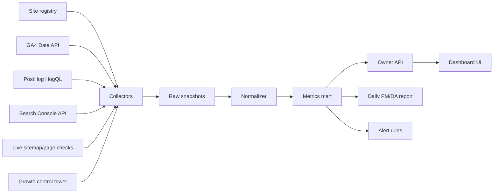

# Owner Live Sites Monitoring Dashboard Design

- Date: 2026-05-14
- Owner goal: GA4 and PostHog are already wired, but the raw dashboards are too hard to read. Build an owner-only dashboard that turns all live-site telemetry into a clear daily operating view.
- Scope: Neo Genesis live SBUs, Neo Genesis parent site, owner portfolio, and future SBU additions such as koreanllm.org.
- Local evidence reviewed:
  - `README.md` SBU registry summary: 11 live business units plus owner portfolio reference.
  - `src/landing/src/lib/data/sbus.ts`: domain-level SBU SSOT for the landing site.
  - `data/sbu-growth/acquisition-dashboard-latest.md`: latest acquisition dashboard generated at `2026-05-14T11:37:50+09:00`.
  - `data/sbu-growth/posthog-traffic-latest.md`: 7-day PostHog probe, 9/9 scoped sites with events.
  - `data/sbu-growth/gsc-all-sbu-latest.md`: 9/9 scoped Search Console properties listed, sitemaps known, and search analytics fetched.
  - `scripts/ga4_traffic_report.py`, `scripts/ga4_traffic_json.py`, `scripts/posthog_traffic.py`, `scripts/sbu_acquisition_dashboard.mjs`: current collector and synthesis layer.
- Official references checked:
  - GA4 Data API `runReport`: https://developers.google.com/analytics/devguides/reporting/data/v1/rest/v1beta/properties/runReport
  - GA4 Data API realtime reporting: https://developers.google.com/analytics/devguides/reporting/data/v1/rest/v1beta/properties/runRealtimeReport
  - GA4 Data API quotas: https://developers.google.com/analytics/devguides/reporting/data/v1/quotas
  - PostHog API overview: https://posthog.com/docs/api
  - PostHog API queries: https://posthog.com/docs/api/queries
  - PostHog events: https://posthog.com/docs/data/events
  - PostHog funnels: https://posthog.com/docs/product-analytics/funnels
  - Search Console Search Analytics API: https://developers.google.com/webmaster-tools/v1/searchanalytics/query

## Korean Executive Summary

결론: 대표님에게 필요한 것은 GA4나 PostHog를 다시 포장한 차트 화면이 아니라, **오늘 무엇을 키우고, 무엇을 고치고, 무엇을 멈출지 결정해주는 오너 전용 관제 콘솔**이다.

핵심 진단:

| 문제 | 현재 근거 | 설계 방향 |
|---|---|---|
| 데이터는 있는데 판단이 어렵다 | GA4, PostHog, GSC, 성장 스크립트가 각각 다른 질문에 답한다. | 첫 화면은 차트가 아니라 `Fix first / Grow first / Watch` 액션 큐로 시작한다. |
| 전체 라이브 사이트 범위가 불완전하다 | 기존 acquisition dashboard는 `neogenesis`, `toolpick`, `ur-wrong`을 제외한다. | v1 범위는 11개 SBU + NeoGenesis parent + HeoYesol portfolio + 신규 koreanllm 후보까지 레지스트리화한다. |
| GA4와 PostHog 숫자가 충돌한다 | 여러 사이트에서 PostHog 사용자는 보이지만 GA4 7d users가 0이다. | 성과 해석보다 먼저 `Measurement Integrity` 경고를 노출한다. |
| 페이지뷰만으로는 수익/제품 신호가 안 보인다 | 기존 성장 설계에서도 CTA/affiliate 이벤트 부족이 위험으로 기록되어 있다. | PostHog는 `decision event` 중심으로 재설계한다. |
| 모델링 성과와 실제 성과가 섞인다 | control tower의 modeled MAU는 준비 글 수 기반 모델이다. | 측정 트래픽과 모델링 지표를 분리 표기한다. |

추천 제품명은 **Owner Traffic Command**다. v1은 읽기 전용 로컬 대시보드로 시작하고, 첫 구현 목표는 `전체 사이트 레지스트리 -> 최신 스냅샷 정규화 -> 소스 무결성 배지 -> 우선순위 액션 큐`다.

## 1. Deep Research Conclusion

The core problem is not lack of analytics. The problem is that GA4, PostHog, GSC, live checks, and growth automation each answer a different question, while the owner needs one question answered first:

> What should I do today to grow, fix, or stop?

Current tooling is source-centric:

| Source | What it sees | Why it is hard for the owner |
|---|---|---|
| GA4 | users, sessions, engagement, host filtered reporting | Site/property mapping can be ambiguous; several subdomains share one property. |
| PostHog | raw events, pageviews, action events, recent activity | Good for behavior, but only if events encode decisions, not just clicks/pageviews. |
| GSC | query/page demand, impressions, clicks, average position | Strong for opportunity, weak for what users did after arriving. |
| Growth scripts | readiness, modeled MAU, quality gates, generated action queues | Useful operator layer, but some outputs are modeled or scoped, not complete live truth. |
| Live smoke checks | whether pages/sitemaps are reachable | Necessary, but reachability is not business performance. |

Therefore the dashboard must be a decision console, not a prettier GA4 clone.

## 2. Current Evidence

### 2.1 Live Site Inventory

The current portfolio has 11 SBUs:

| Group | Sites |
|---|---|
| High-traffic / special ownership | ToolPick, UR WRONG, NeoGenesis parent |
| Korean products | ReviewLab, K-OTT |
| Global commercial SBUs | AIForge, CraftDesk, DeployStack, FinStack, SellKit |
| Research / product proof | WhyLab, EthicaAI |
| Owner brand | HeoYesol portfolio |
| New pipeline candidate | koreanllm.org |

Design implication: the dashboard cannot inherit the current `acquisition-dashboard-latest` exclusion set as the product scope. That file excludes `neogenesis`, `toolpick`, and `ur-wrong`; the owner dashboard should include them, while still allowing filtered views.

### 2.2 Latest Local Snapshot

From `data/sbu-growth/acquisition-dashboard-latest.md` generated on `2026-05-14T11:37:50+09:00`:

| Signal | Finding |
|---|---|
| Top acquisition priority | SellKit, ReviewLab, K-OTT, CraftDesk, DeployStack |
| Measurement warning pattern | PostHog shows recent users while GA4 7d users are zero on several sites. |
| Highest non-excluded search opportunity | SellKit `printful alternatives`, ReviewLab Korean review queries |
| Existing action style | Good: site-specific next actions already exist. Missing: owner-level prioritization and action state. |

From `posthog-traffic-latest.md`:

| Metric | Value |
|---|---:|
| Scoped sites with events | 9/9 |
| 7-day total events | 676 |
| 7-day total pageviews | 259 |
| Highest scoped PH users | ReviewLab 51, CraftDesk 43, K-OTT 40, DeployStack 37 |

From `gsc-all-sbu-latest.md`:

| Metric | Value |
|---|---:|
| Scoped properties listed | 9/9 |
| Live sitemaps ok | 9/9 |
| GSC sitemaps known | 9/9 |
| Search analytics fetch ok | 9/9 |
| Total rows | 142 |

### 2.3 Measurement Integrity Gaps

Observed gaps to make first-class in the dashboard:

| Gap | Evidence | Dashboard treatment |
|---|---|---|
| Incomplete source scope | Acquisition dashboard excludes ToolPick, UR WRONG, NeoGenesis. | Site registry must include all live sites and show source coverage per site. |
| GA4 vs PostHog mismatch | Several sites have PH users but GA4 7d users = 0. | Integrity badge: `GA4_STALE_OR_MAPPED_WRONG`. |
| Conversion ambiguity | Existing planning notes say CTA/affiliate events are near zero. | Dashboard must separate pageview events from decision/action events. |
| Modeled vs real performance | Control tower reports modeled MAU from ready posts. | Display modeled metrics separately from measured traffic. |
| Korean encoding/query quality | Current GSC markdown contains mojibake in Korean query text in some places. | Korean-market panel must validate Unicode rendering and preserve raw/source text. |

### 2.4 P0 Corrections Before Build

This design should not move to UI implementation until the following corrections are applied.

| Severity | Correction | Why it is required |
|---|---|---|
| P0 | Create `site_registry` and `source_coverage_matrix` before any chart work. | The current source scope excludes important live sites. |
| P0 | Replace the broad `GA4_STALE_OR_MAPPED_WRONG` warning with typed integrity findings. | GA4/PostHog mismatch can come from several different causes and needs different fixes. |
| P0 | Use a PostHog `decision_event_allowlist`; never count `event != "$pageview"` as a business action. | Non-pageview events can include instrumentation noise. |
| P0 | Keep GA4/PostHog/GSC credentials only inside collector processes. | The dashboard UI must never receive raw keys, tokens, refresh tokens, or service-account material. |
| P0 | Add UTF-8/raw-text QA for Korean GSC query and page fields. | Mojibake in ReviewLab/K-OTT data would corrupt the owner's Korean growth decisions. |
| P1 | Start v1 with three tabs only: `Command`, `Sites`, `Integrity`. | Search, Behavior, Experiments, and Reports are valuable but will slow the first trustworthy release. |
| P1 | Split GA4 returning users and PostHog repeat-user proxy. | They are not equivalent and should not be merged into one number in v1. |
| P2 | Move experiments and growth-spike alerts to v2. | They depend on stable event taxonomy and enough historical data. |

### 2.5 Independent Review Hardening Decisions

An independent review of this design added one stricter implementation rule: every principle in this document must become a contract or a test before UI polish begins.

| Area | Hardening decision |
|---|---|
| Encoding | Add a Korean GSC fixture and test raw JSON to normalized JSON to report/UI rendering. Fail on `�`, common mojibake fragments, or broken percent-decoding. |
| Registry | `site_registry` is generated from declared sources with explicit precedence, not handwritten from memory. |
| Snapshot | `owner-traffic-latest.json` must have schema versioning, run id, atomic write, source run status, stale TTL, and last-good fallback. |
| Metrics | PostHog decision metrics must define denominator, dedupe, session window, internal/bot exclusion, and page-type allowlist. |
| Integrity | Every finding needs a numeric trigger and source window. Generic warnings are not enough. |
| UI | V1 first viewport is reduced to `Data Trust Gate`, `Top 3 Actions`, and `Broken/Untrusted Sites`. |
| Acceptance | Acceptance criteria must be executable gates, not product statements. |

## 3. Product Principle

The owner dashboard should answer in this order:

1. **Is anything broken?** Measurement, tracking, sitemap, live page, deploy, source freshness.
2. **Where is real user attention today?** Recent users, returning users, page depth, action events.
3. **Where is demand forming?** GSC impressions, CTR, average position, top query/page opportunity.
4. **Where is commercial intent?** CTA, affiliate, official outbound, calculator/filter, signup/newsletter.
5. **What should I do next?** One ranked action queue with reason, confidence, and evidence.

This is the opposite of normal analytics dashboards. Normal dashboards start with charts. This should start with decisions.

## 4. Primary Personas

| Persona | Job |
|---|---|
| Owner / Operator | Open once or twice a day and decide what to fix, grow, pause, or delegate. |
| DA | Verify metric integrity and explain movements without fabricating or overfitting. |
| PM | Turn signals into site/page/product actions. |
| Growth Agent | Pick next content, distribution, or instrumentation task under standing approval. |
| Ops Agent | Detect stale credentials, broken tracking, failed source jobs, deploy/runtime issues. |

## 5. North Star And KPI Stack

North star for this stage:

`Returning user growth + decision-event growth across live sites`

The owner does not need only more pageviews. The useful loop is:

`search/user source -> qualified visit -> decision interaction -> return or outbound/revenue event -> next action`

### 5.1 Owner KPI Cards

| KPI | Meaning | Source |
|---|---|---|
| GA4 Returning Users | Are any sites becoming habit/revisit surfaces? | GA4 only when available |
| PH Repeat User Proxy | Does PostHog show repeat distinct IDs? | PostHog, shown separately from GA4 returning users |
| Qualified Sessions | Sessions with 2+ pages, engagement, or action event | GA4 + PostHog |
| Decision Events / 100 PV | Are users doing anything meaningful? | PostHog |
| Search Opportunity Impressions | Where demand exists but clicks are not captured yet | GSC |
| Measurement Integrity Score | Can today's conclusion be trusted? | Collector health + cross-source comparison |

V1 rule: do not blend `GA4 Returning Users` and `PH Repeat User Proxy` into a single North Star number. Show both, explain source confidence, and only introduce a blended retention score after 2-4 weeks of validated history.

### 5.2 Site Stage Model

| Stage | Rule of thumb | Owner action |
|---|---|---|
| `capture-now` | Search opportunity or real traffic already visible | Improve page title/CTA/conversion path immediately. |
| `distribution-validation` | Users appear, but search or action proof is thin | Find source, validate intent, seed one channel. |
| `productize-before-growth` | Low traffic and weak product action | Build concrete tool/template/checklist before more content. |
| `measurement-broken` | Source mismatch or stale telemetry | Fix tracking before interpreting performance. |
| `watch` | Healthy but no urgent move | Keep monitoring, no extra work today. |

## 6. Dashboard Information Architecture

### 6.1 First Screen: Owner Command Center

The first viewport should be dense, quiet, and operational.

Required modules:

1. **Data Freshness Strip**
   - GA4 fetched at
   - PostHog fetched at
   - GSC fetched at
   - live checks fetched at
   - source failures count

2. **Today Decision Cards**
   - Fix first
   - Grow first
   - Rising page
   - Conversion leak
   - Watchlist

3. **Live Site Status Rail**
   - One compact cell per live site
   - Color states: healthy, watch, integrity warning, stale, broken
   - Hover shows last GA4/PH/GSC timestamp and last event

4. **Priority Queue**
   - Rank
   - Site
   - Stage
   - Owner Priority Score
   - Evidence
   - Next action
   - Confidence
   - Action status

5. **Integrity Warnings**
   - GA4 zero / PostHog active
   - PostHog stale
   - GSC stale
   - missing source coverage
   - event taxonomy missing
   - page live but no analytics

### 6.2 Main Navigation

| Tab | Purpose |
|---|---|
| Command | Daily owner decisions. |
| Sites | Cross-site table and site detail drawers. |
| Search | GSC opportunity and query/page diagnosis. |
| Behavior | PostHog page/action/funnel behavior. |
| Integrity | Source health, tracking mismatches, coverage map. |
| Experiments | Before/after changes, active growth tests, outcomes. |
| Reports | Daily/weekly exportable PM/DA brief. |

V1 navigation lock:

| V1 Tab | Included content |
|---|---|
| Command | First-screen decision cards, live site rail, priority queue, top integrity warnings. |
| Sites | Cross-site table and site drawer. Search and behavior evidence appear inside the drawer. |
| Integrity | Source coverage matrix, typed findings, stale runs, UTF-8 checks, missing event taxonomy. |

Deferred tabs:

| Deferred Tab | Target phase | Reason |
|---|---|---|
| Search | v1.5 | Start as site-drawer section until GSC page/query normalization is stable. |
| Behavior | v1.5 | Start as site-drawer section until PostHog decision-event allowlist is validated. |
| Experiments | v2 | Requires stable event taxonomy and before/after windows. |
| Reports | v2 | Daily Markdown can be generated first without a full tab. |

### 6.3 Site Detail Drawer

Clicking a site opens a right-side drawer, not a full page jump.

Sections:

1. **Site Summary**
   - domain
   - market
   - product lane
   - current stage
   - owner priority score
   - last meaningful event

2. **Source Truth**
   - GA4 7d/28d users, sessions, views
   - PostHog 7d users, pageviews, actions
   - GSC 28d clicks, impressions, CTR, position
   - live sitemap and page status
   - source coverage badge

3. **Top Pages**
   - URL
   - page type
   - GSC impressions/clicks
   - GA4 users/views
   - PostHog pageviews/actions
   - action rate

4. **Funnel**
   - `$pageview`
   - `content_answer_seen`
   - `comparison_table_seen` or page-class equivalent
   - `cta_viewport_reached`
   - `cta_click` / `affiliate_click` / `provider_click`

5. **Recommended Action**
   - action
   - why now
   - expected impact
   - verification method
   - owner approval class: G1 or G2

## 7. Data Architecture

### 7.1 Pipeline



### 7.2 Storage

Recommended first implementation:

| Layer | Storage | Reason |
|---|---|---|
| Raw source snapshots | `data/owner-analytics/raw/*.json` | Auditable, easy rollback, matches current file-based practice. |
| Normalized latest snapshot | `data/owner-analytics/owner-traffic-latest.json` | V1 source for the UI; simplest reliable path. |
| Lightweight mart | SQLite | Optional v1.5 storage if latest-state JSON becomes too limiting. |
| Analytical mart | DuckDB | Defer to v2 when cohort/trend/page-level analytical joins become necessary. |
| Latest API cache | `data/owner-analytics/latest.json` | UI can render even if a collector fails. |
| Reports | `data/owner-analytics/reports/*.md` | PM/DA brief history. |

V1 storage decision: start with raw JSON snapshots plus one normalized `owner-traffic-latest.json`. Add SQLite only when action state, dismissed warnings, or site-level history needs local persistence. Defer DuckDB until v2.

### 7.2.1 Snapshot Contract

`owner-traffic-latest.json` is a contract, not a loose cache file. The UI must render only from this normalized snapshot or an internal API that returns the same shape.

Required top-level fields:

| Field | Purpose |
|---|---|
| `snapshot_version` | Schema version, e.g. `1.0`. |
| `snapshot_id` | Unique run id for traceability. |
| `generated_at` | Normalized snapshot generation timestamp. |
| `timezone` | Expected `Asia/Seoul`. |
| `source_runs[]` | Per-source collector status, started/finished time, stale state, and sanitized error. |
| `source_errors[]` | Sanitized errors that affected the snapshot. |
| `stale_seconds` | Snapshot age at render time or generated age. |
| `data_trust_state` | `trusted`, `partial`, `stale`, `untrusted`, or `blocked_by_measurement`. |
| `is_last_good` | True when serving the last successful snapshot after a collector failure. |
| `supersedes_snapshot_id` | Previous snapshot id when available. |
| `registry_version` | Site registry version used for this run. |
| `sites[]` | One row per registry site, including incomplete tracking rows. |
| `findings[]` | Typed integrity findings with numeric trigger evidence. |
| `actions[]` | Ranked owner actions with evidence and action class. |

Write rules:

| Rule | Requirement |
|---|---|
| Atomic write | Write to a temporary file, validate schema, then rename to latest. |
| Last-good fallback | Collector failure must not overwrite latest with empty/zero data. Render last-good plus stale/error banner. |
| Retention | Keep raw snapshots for at least 30 days or 100 runs, whichever is smaller in storage impact. |
| Partial failure | A failed source sets `data_trust_state=partial` or `stale`, not `trusted`. |
| Schema validation | UI and reports refuse unknown major `snapshot_version`. |

### 7.3 Registry Schema

`site_registry` should be the single source for dashboard scope.

| Field | Example | Notes |
|---|---|---|
| `site_id` | `sellkit` | Stable id. |
| `name` | `SellKit` | Display name. |
| `domain` | `sellkit.neogenesis.app` | No protocol. |
| `url` | `https://sellkit.neogenesis.app` | Canonical URL. |
| `market` | `global` / `korea` | Reporting lens. |
| `lane` | `ecommerce sellers` | PM grouping. |
| `status` | `LIVE` / `BETA` | From registry. |
| `ga4_property` | `properties/...` | Secret-free metadata only. |
| `ga4_host_filter` | `sellkit.neogenesis.app` | Required for shared properties. |
| `posthog_site_id` | `sellkit` | Event property value. |
| `gsc_property_url` | `https://sellkit.neogenesis.app/` | Exact Search Console property. |
| `priority_class` | `core`, `watch`, `research` | Owner prioritization. |
| `include_in_v1` | `true` | Explicit scope decision. |
| `exclusion_reason` | `missing_ga4_mapping` | Required if excluded. |
| `tracking_confidence` | `verified`, `partial`, `unknown`, `broken` | Drives integrity state. |
| `owner_action_class` | `G1` / `G2` | Prevents accidental external or risky actions. |
| `registry_sources` | `sbus.ts`, `ga4_traffic_report.py`, `posthog_traffic.py` | Source files used to derive the row. |
| `source_precedence` | `agent_ssot > sbus.ts > collector_config > README` | Conflict resolution. |
| `generated_from` | file path or script name | Audit trail. |
| `last_verified_at` | timestamp | Last manual or automated verification. |
| `domain_aliases` | `www.example.com`, legacy domains | Host matching and redirects. |
| `canonical_host` | `sellkit.neogenesis.app` | GA4/PostHog/GSC matching key. |
| `blog_url` | `/blog` or null | Live-check target. |
| `sitemap_url` | `/sitemap.xml` | Live/GSC target. |
| `repo_path` | local path | Build/deploy traceability. |
| `deployment_provider` | `vercel`, `cloudflare`, etc. | Live/deploy evidence. |
| `deployment_project_id_ref` | sanitized ref only | Never raw high-entropy ids in reports. |
| `expected_ga_measurement_id_ref` | sanitized ref only | Live HTML check without exposing full ids in public text. |
| `posthog_capture_mode` | `auto`, `manual_pageview`, `mixed`, `unknown` | Prevents false duplicate/broken conclusions. |
| `gsc_property_type` | `url_prefix` / `domain` / `unknown` | Search Console matching semantics. |

Registry source precedence:

1. `.agent`/workspace SSOT and explicit owner decisions.
2. `src/landing/src/lib/data/sbus.ts` for canonical SBU identity and public domains.
3. Collector configs for current telemetry mappings.
4. README/planning docs as reference only.
5. Live HTML/GSC/API checks as verification evidence, not identity SSOT unless a mismatch is logged.

Initial registry must cover these site ids at minimum:

| Required v1 status | Site ids |
|---|---|
| Include | `neogenesis`, `toolpick`, `ur-wrong`, `reviewlab`, `kott`, `whylab`, `ethicaai`, `finstack`, `aiforge`, `sellkit`, `deploystack`, `craftdesk`, `heoyesol` |
| Candidate / explicit decision | `koreanllm` |

No site may silently disappear from the dashboard. If a source mapping is missing, keep the site visible with `tracking_confidence=unknown` and a P0 coverage finding.

### 7.4 Metric Tables

| Table | Purpose |
|---|---|
| `source_runs` | Each collector run, status, duration, freshness, error. |
| `site_metric_snapshots` | Site-window metrics from GA4/PostHog/GSC. |
| `page_metric_snapshots` | URL-level traffic, action, and search metrics. |
| `event_taxonomy_coverage` | Required events detected or missing per site/page type. |
| `measurement_integrity_findings` | Cross-source mismatch records. |
| `owner_actions` | Ranked actions, evidence, status, and verification. |
| `experiments` | Before/after changes and outcome windows. |

### 7.5 Secret Boundary

The dashboard is a read-only consumer of normalized data.

| Boundary | Rule |
|---|---|
| Frontend | Reads only normalized JSON/internal API. No GA4, PostHog, GSC, OAuth, refresh token, service account, or personal API key material. |
| Collector | The only layer allowed to load credentials. Runs server-side or local-only. |
| Reports | Must include source status and sanitized property/site ids only. Never print tokens or raw service-account data. |
| Logs | Store error type, HTTP status, source name, and timestamp. Do not store request headers or credential-bearing URLs. |
| Deep links | Open GA4/PostHog/GSC dashboards without embedding private keys. |

### 7.6 Redaction Policy

Telemetry tooling often touches identifiers that are not secrets but can trigger scanners or leak operational details. Reports, logs, commits, and dashboard JSON must use this redaction policy.

| Data type | Rule |
|---|---|
| Raw secrets/tokens/refresh tokens/service accounts | Never log, render, commit, or include in snapshots. |
| Credential file paths | Do not include exact paths in dashboard JSON or reports; use source labels like `oauth_refresh_token_configured`. |
| High-entropy ids, 32+ char hex/base64, token ids | Prefix-only or `[redacted-id]`. |
| API error bodies | Store sanitized status/code and first safe message only. Strip headers and credential-bearing URLs. |
| HogQL query logs | Allow only template id and sanitized site id; do not persist full query if it includes user-provided URLs. |
| GA4 property ids / deployment ids | Store internal refs in local JSON; public/owner reports use sanitized refs unless exact ids are needed for debugging. |

## 8. Collector Design

### 8.1 GA4 Collector

Use the existing `ga4_traffic_report.py` token resolver and extend the query plan.

Minimum GA4 queries:

| Query | Window | Dimensions | Metrics |
|---|---|---|---|
| Site summary | today, 7d, 28d | hostName where needed | activeUsers, sessions, screenPageViews |
| Engagement | 7d, 28d | hostName | engagementRate, averageSessionDuration, screenPageViewsPerSession, bounceRate |
| Page summary | 7d, 28d | pagePathPlusQueryString or fullPageUrl | activeUsers, sessions, screenPageViews |
| Realtime | last 30 minutes | hostName, pagePath | activeUsers |

Official constraints:

- `runReport` returns table-style report data by requested dimensions and metrics.
- `runRealtimeReport` covers near-real-time event data, normally up to the last 30 minutes for standard GA4.
- Standard property quota is large enough for this use if we batch and cache, but concurrent requests per property are limited, so collectors should queue per property.

GA4 quota/backoff contract:

| Control | Requirement |
|---|---|
| `returnPropertyQuota` | Request property quota metadata in diagnostic runs and store sanitized quota status in `source_runs`. |
| Per-property concurrency | Max 1-2 concurrent GA4 requests per property; shared property requests should be batched. |
| Retry budget | Retry 429/5xx with exponential backoff and jitter, capped to a small budget per run. |
| Failure behavior | On quota/5xx failure, preserve last-good snapshot and mark GA4 source `stale` or `partial`. |
| Shared property strategy | Query property total and host-filtered rows separately to detect host filter mismatches. |

Typed GA4 integrity findings:

| Finding | Trigger | First fix |
|---|---|---|
| `GA4_SOURCE_STALE` | GA4 collector did not refresh inside SLA. | Rerun collector and inspect token resolution. |
| `GA4_HOST_FILTER_ZERO` | `PH users >= 5` and `PH pageviews >= 10` over 7d, GA4 site users 7d is 0, and GA4 shared property total is greater than 0. | Verify hostName filter, canonical host, and live page hostname. |
| `GA4_SCRIPT_MISSING_LIVE` | Live HTML/network check does not show expected GA tag. | Verify deploy env and analytics component. |
| `GA4_PERMISSION_OR_PROPERTY_ERROR` | API returns permission/property errors. | Fix OAuth/service-account access before interpreting metrics. |
| `GA4_TIMEZONE_LAG` | Today/realtime is zero but 7d/28d are plausible. | Treat as low severity unless PH/live evidence contradicts. |

### 8.2 PostHog Collector

Use HogQL via `/api/projects/:project_id/query/`, as the existing `posthog_traffic.py` already does.

Minimum HogQL query groups:

| Query | Purpose |
|---|---|
| site rollup | events, pageviews, action events, distinct users, last seen |
| page rollup | pageviews and action events by URL |
| required event coverage | which required events exist per site/page type |
| decision funnel | `$pageview` to page-class action events |
| returning users proxy | distinct IDs seen in current window and before current window |

V1 query rule: `action_events` must be computed from `decision_event_allowlist`, not `event != '$pageview'`.

Typed PostHog integrity findings:

| Finding | Trigger | First fix |
|---|---|---|
| `POSTHOG_SOURCE_STALE` | Collector did not refresh inside SLA. | Rerun collector and inspect API response. |
| `POSTHOG_SITE_ID_MISSING` | Events exist for host but not normalized `site_id`. | Fix shared helper event properties. |
| `POSTHOG_ONLY_MANUAL_PAGEVIEW` | Site intentionally uses manual pageviews, such as UR WRONG-style flow. | Mark mode explicitly so it is not treated as duplicate/broken. |
| `POSTHOG_DECISION_EVENT_ZERO` | `PH pageviews >= 20` over 7d and allowlisted decision events are 0. | Instrument CTA/filter/outbound events before growth interpretation. |
| `POSTHOG_NOISE_SUSPECTED` | Non-pageview events are at least 5x allowlisted decision events over 7d. | Audit event names and exclude telemetry noise. |

Official constraints:

- Private API requests require a personal API key and should stay server-side.
- `/query` is good for embedded/ad-hoc analytics, not large recurring exports.
- Use short time ranges and aggregation; do not export raw events through `/query`.
- Query endpoint rate limits exist, so dashboards should read cached snapshots, not query live on every render.

### 8.3 Search Console Collector

Use Search Analytics for query/page opportunity and sitemap API for known sitemap state.

Minimum GSC queries:

| Query | Window | Dimensions |
|---|---|---|
| site summary | 28d | none |
| query/page opportunities | 28d | query, page |
| device/country | 28d | device, country |
| date trend | 28d | date |

Design note: GSC is delayed and partial by nature. Treat it as demand/opportunity signal, not live-traffic truth.

GSC integrity findings:

| Finding | Trigger | First fix |
|---|---|---|
| `GSC_SOURCE_STALE` | Latest Search Console snapshot is outside SLA. | Rerun collector. |
| `GSC_PROPERTY_MISSING` | Site has no matched property. | Add property mapping or label as not configured. |
| `GSC_SITEMAP_UNKNOWN` | Live sitemap exists but GSC does not know it. | Submit sitemap and verify result. |
| `GSC_UTF8_BROKEN` | Korean query/page fields fail UTF-8/mojibake checks. | Preserve raw JSON and repair report rendering. |
| `GSC_DELAYED_DATA` | New site/page has no rows inside expected 2-3 day delay window. | Mark delayed, not failed, until data window is mature. |
| `GSC_PARTIAL_DETAIL_DATA` | Site summary exists but query/page detail is missing or sparse. | Treat as partial detail coverage, not source failure. |

## 9. Owner Priority Score

Create one understandable score, but always show the evidence behind it.

Proposed formula:

```text
owner_priority_score =
  search_opportunity_score * 0.30
  + measured_traction_score * 0.25
  + decision_event_score * 0.20
  + freshness_score * 0.10
  + strategic_weight * 0.10
  - measurement_integrity_penalty * 0.25
```

Scoring contract:

| Rule | Requirement |
|---|---|
| Component normalization | Convert every component to a 0-100 score before applying weights. Use percentile or threshold bands, not raw counts. |
| Clamp | Final score is clamped to 0-100. |
| Integrity override | If `data_trust_state=untrusted` or a site has P0 measurement findings, show `blocked_by_measurement` instead of a growth score. |
| Explainability | Store score components and top evidence in `actions[].evidence`. |
| Anti-bias | High GSC impressions cannot outweigh red measurement integrity. |

Score inputs:

| Component | Inputs |
|---|---|
| search opportunity | GSC impressions, position, CTR gap, query intent class |
| measured traction | GA4 users/sessions/views, PH users/pageviews |
| decision event | allowlisted CTA, affiliate, provider, filter, calculator, shortlist, vote/start events |
| freshness | latest data run, latest content/deploy where relevant |
| strategic weight | core SBU, Korean market priority, near-monetization potential |
| integrity penalty | stale source, mismatch, missing host mapping, missing events |

Important: never hide a measurement problem behind a high score. If integrity is red, the top recommendation should be "fix measurement" rather than "scale."

## 10. Event Taxonomy Contract

PostHog should become the decision-event source. Required events:

| Event | Use | V1 action allowlist |
|---|---|---:|
| `content_answer_seen` | User saw the useful answer block. | false |
| `comparison_table_seen` | User reached comparison substance. | false |
| `comparison_filter_change` | User interacted with decision filtering. | true |
| `cta_viewport_reached` | User reached conversion surface. | false |
| `cta_click` | User clicked generic CTA. | true |
| `affiliate_click` | User clicked monetizable outbound. | true |
| `outbound_official_click` | User clicked vendor/provider. | true |
| `internal_next_click` | User continued through a content cluster. | true |
| `source_expand` | User inspected evidence/methodology. | false |

Required properties:

| Property | Example |
|---|---|
| `site_id` | `sellkit` |
| `market` | `global` |
| `audience_locale` | `en-US` |
| `page_type` | `alternative` |
| `intent_cluster` | `printful_alternatives` |
| `content_id` | slug |
| `experiment_id` | `sellkit-printful-hero-v1` |

Site-specific additions:

| Site | Required extra events |
|---|---|
| ReviewLab | `buyer_snapshot_seen`, `pros_cons_seen`, `price_check_click` |
| K-OTT | `recommendation_filter_change`, `provider_click`, `watchlist_click` |
| ToolPick | `comparison_shortlist_add`, `pricing_click`, `alternative_click` |
| UR WRONG | `debate_started`, `argument_generated`, `vote_submitted` |

### 10.1 Decision Event Allowlist

V1 `Decision Events / 100 PV` must count only these events:

```json
[
  "comparison_filter_change",
  "cta_click",
  "affiliate_click",
  "outbound_official_click",
  "internal_next_click",
  "price_check_click",
  "provider_click",
  "watchlist_click",
  "comparison_shortlist_add",
  "pricing_click",
  "alternative_click",
  "debate_started",
  "vote_submitted"
]
```

Events such as `content_answer_seen`, `comparison_table_seen`, `cta_viewport_reached`, and `source_expand` are useful funnel/support events, but they are not conversion or product-action events in v1.

### 10.1.1 Decision Metric Semantics

`Decision Events / 100 PV` must be reproducible across GA4/PostHog disagreement.

| Term | V1 definition |
|---|---|
| Numerator | Count of allowlisted decision events after internal/bot exclusion and page-type filtering. |
| Denominator | PostHog `$pageview` count for the same `site_id`, time window, and page filters. Use GA4 only as comparison, not denominator. |
| Dedupe | For click-like events, count first matching event per `distinct_id + content_id + event + day`; keep raw count separately. |
| Session window | 30 minutes of inactivity for session-like grouping when needed. |
| Anonymous/identified users | Do not assume identity merge unless PostHog person merging is confirmed; show distinct-id based proxy. |
| Internal/bot exclusion | Exclude known internal hosts, test flags, localhost/referrer previews, and bot-like repeated pageview patterns where detectable. |
| Page-type allowlist | Each `page_type` declares which decision events count. Example: ReviewLab review pages allow `price_check_click`; K-OTT pages allow `provider_click`. |

### 10.1.2 Funnel Spec

PostHog funnel calculations must pin semantics instead of relying on UI defaults.

| Setting | V1 value |
|---|---|
| Step order | sequential |
| Occurrence | first matching event per user/session window |
| Conversion window | 7 days for content-to-action funnels; 30 minutes for same-session interaction funnels |
| Breakdown attribution | specific step |
| Required breakdowns | `site_id`, `page_type`, `intent_cluster`, `audience_locale` |
| Exclusion | internal/bot/test traffic excluded before funnel calculation |

### 10.2 Event QA

| QA check | Gate |
|---|---|
| Required properties present | 95 percent plus of allowlisted decision events include `site_id`, `page_type`, `content_id`. |
| `site_id` normalized | No whitespace, aliases, or mixed casing in new events. |
| URL privacy | Store destination URL hash for outbound events unless the URL is already public and non-sensitive. |
| Korean locale | ReviewLab/K-OTT events include `audience_locale=ko-KR` or equivalent. |
| Noise guard | Non-pageview events cannot be used as decision events unless allowlisted. |

## 11. UI Design Direction

This is an operations tool, not a marketing page.

Visual rules:

- Dense but calm layout.
- White or neutral base, not a dramatic dark dashboard.
- No hero section.
- No decorative card-heavy landing-page composition.
- Tables and status rails over bento grids.
- 8px radius or lower.
- Use compact line charts, sparklines, segmented filters, and drawer details.
- Use icons for source states: GA4, PH, GSC, Live, Deploy.
- Korean text must be tested for mojibake and wrapping.

V1 first-viewport simplification:

| Region | Content |
|---|---|
| Data Trust Gate | Overall `data_trust_state`, stale sources, P0 integrity findings. |
| Top 3 Actions | Three owner actions only, each with reason and confidence. |
| Broken/Untrusted Sites | Sites blocked by measurement, live failures, or missing source coverage. |

Everything else starts below the first viewport or inside the site drawer. This prevents the command screen from becoming another dense analytics wall.

### 11.1 Primary Screen Wireframe

```text
┌────────────────────────────────────────────────────────────────────────────┐
│ Owner Traffic Command                         Fresh: GA4 11:35 PH 11:29  │
├────────────────────────────────────────────────────────────────────────────┤
│ Fix First        Grow First        Rising Page      Conversion Leak        │
│ GA4/PH mismatch  SellKit Printful  ReviewLab query  CraftDesk action gap  │
├────────────────────────────────────────────────────────────────────────────┤
│ Sites:  Neo  Tool  UR  Rev  KOTT  Sell  Craft  Deploy  AI  Fin  Why  Eth  │
│         ok   ok    warn ok   watch hot   warn   warn    low low  low  low │
├──────────────────────────────┬─────────────────────────────────────────────┤
│ Priority Queue               │ Trend / Evidence                           │
│ 1 SellKit capture-now        │ selected row mini timeline                 │
│ 2 ReviewLab capture-now      │ GSC query + PH action + GA4 integrity      │
│ 3 K-OTT distribution         │                                             │
│ 4 CraftDesk measurement      │                                             │
├──────────────────────────────┴─────────────────────────────────────────────┤
│ Integrity Warnings                                                        │
│ PH active but GA4 zero: ReviewLab, CraftDesk, DeployStack, EthicaAI       │
└────────────────────────────────────────────────────────────────────────────┘
```

### 11.2 Site Table Columns

| Column | Notes |
|---|---|
| Site | name + domain |
| Stage | lifecycle stage |
| Integrity | source health badge |
| 7d Users | GA4 primary, PH fallback shown separately |
| Returning | GA4 if available, PH proxy if not |
| PH Actions | decision events, not all non-pageview events |
| GSC Opps | count + impression total |
| Top Page | opportunity page or behavior page |
| Next Action | one line |
| Confidence | high/medium/low |

## 12. Automation And Alerts

Phase 1 should be read-only. Later actions can be added with explicit safety class.

| Action | Class | Rule |
|---|---|---|
| Refresh local analytics snapshot | G1 | Read-only, safe. |
| Open GA4/PostHog/GSC deep link | G1 | Browser navigation only. |
| Mark action done/snoozed | G1 | Local dashboard state. |
| Trigger growth report generation | G1 | Local file output only. |
| Trigger publish/deploy/indexing | Not executable in v1 UI | Show recommendation only. Execution must stay in existing governed workflows. |
| Send external message/email/public post | G2 | Requires explicit owner approval. |
| Credential changes | G2 | Never triggered from this dashboard. |

Alert types:

| Alert | Trigger |
|---|---|
| `source_stale` | source not refreshed within expected window |
| `tracking_mismatch` | PH users above threshold and GA4 zero |
| `conversion_zero` | traffic present but no action events |
| `live_broken` | homepage/blog/sitemap non-200 |

V1 alert lock:

| Included in v1 | Reason |
|---|---|
| `source_stale` | Low-noise, operationally actionable. |
| `tracking_mismatch` | Prevents false growth conclusions. |
| `live_broken` | Direct site availability risk. |

Alert noise controls:

| Control | V1 value |
|---|---|
| Dedupe key | `site_id + finding_type + source` |
| Minimum consecutive failures | 2 runs before owner-facing alert |
| Cooldown | 12 hours per dedupe key |
| Auto-resolve | 2 consecutive green runs |
| Quiet hours | Local-only logging during owner-defined quiet hours unless P0 live broken persists |
| Suppression | Known incident id suppresses duplicate alerts but remains visible in Integrity tab |
| Routing | V1 defaults to local dashboard only; Telegram/Sora delivery is opt-in after noise review |

Deferred alerts:

| Deferred | Reason |
|---|---|
| `traffic_spike` | Needs a baseline and bot/internal filtering. |
| `opportunity_spike` | Needs stable GSC history and CTR thresholds. |
| `conversion_zero` | Promote to v1.5 after decision-event allowlist coverage is validated. |

## 13. Implementation Plan

### Phase 0: Scope Reconciliation

Deliverables:

- `site_registry.json` for all live sites, not just 9 scoped SBUs.
- `source_coverage_matrix.json` per site: GA4, PostHog, GSC, live checks, inclusion status, and exclusion reason.
- Typed measurement-integrity rule set for GA4, PostHog, GSC, and live checks.
- `decision_event_allowlist.json` for PostHog action calculations.
- UTF-8/raw-text QA for Korean GSC fields and report rendering.
- Explicit decision on whether `koreanllm.org` is v1 include, candidate, or excluded.

Completion criteria:

- Every live site has a domain, GA4 mapping status, PostHog mapping status, GSC property status, live-check status, tracking confidence, and include/exclude reason.
- No dashboard screen is allowed to hide sites with incomplete tracking. Incomplete sites stay visible with integrity warnings.
- Korean query/page text is verified from raw JSON through rendered UI/report output.

### Phase 0.5: Snapshot Contract And Fixtures

Deliverables:

- JSON Schema for `site_registry.json`, `source_coverage_matrix.json`, `decision_event_allowlist.json`, and `owner-traffic-latest.json`.
- Fixture snapshots for:
  - all sources green
  - GA4 failure with last-good fallback
  - PostHog decision-event zero
  - GSC delayed data
  - Korean GSC mojibake failure
  - missing tracking for a visible site
- Normalizer command that reads existing latest files and writes `owner-traffic-latest.json` atomically.

Completion criteria:

- Schema validation passes for all fixtures.
- UI work may start only after the fixture snapshot contract is stable.
- A collector failure fixture renders last-good stale state, not zeroed metrics.

### Phase 1: Read-Only Local Dashboard

Recommended build:

- Frontend: React + Vite or existing Next.js app if integrating into Neo Genesis deployment.
- Data: read only `data/owner-analytics/owner-traffic-latest.json` or an internal API backed by that file.
- No frontend secrets; collectors are the only credential-loading layer.
- Manual refresh command only.
- Tabs: `Command`, `Sites`, `Integrity` only.

Completion criteria:

- Owner can open one local URL and see:
  - all live sites
  - data freshness
  - source coverage
  - priority queue
  - integrity warnings
  - site drawer
- UI labels modeled metrics separately from measured traffic.
- GA4 returning users and PostHog repeat-user proxy are shown separately.

### Phase 2: Normalized Collectors

Deliverables:

- Extend GA4 collector for engagement, page-level, and realtime summary.
- Extend PostHog collector for event taxonomy coverage, allowlisted decision events, and funnels.
- Extend GSC collector for site/page/query snapshots.
- Write normalized snapshots to raw JSON plus `owner-traffic-latest.json`; add SQLite only if action state/history needs it.

Completion criteria:

- Dashboard no longer depends on manual reading of multiple reports.
- A failed source run degrades gracefully and shows stale/error state.
- PostHog action event count never uses `event != '$pageview'`.

### Phase 3: Decision Event Instrumentation

Deliverables:

- Shared PostHog helper across SBU sites.
- Required event taxonomy implemented on top 3 priority sites first: SellKit, ReviewLab, K-OTT.
- Event coverage panel shows missing events per site/page type.

Completion criteria:

- Dashboard can calculate decision events per 100 pageviews.
- Conversion-zero warnings become reliable.
- Event coverage reaches at least 80 percent on the top 3 priority sites before experiments are introduced.

### Phase 4: Reports And Alerts

Deliverables:

- Daily owner brief Markdown.
- Weekly PM/DA report.
- Local alert rules for `source_stale`, `tracking_mismatch`, and `live_broken` only.

Completion criteria:

- Daily report says:
  - what to do this week
  - what to stop
  - what to test
  - which numbers are untrusted
- Growth-spike and opportunity-spike alerts remain deferred until a clean baseline exists.

## 14. Acceptance Criteria

The dashboard is successful when these gates pass:

| Gate | Testable requirement |
|---|---|
| Registry completeness | Every required live site appears in `site_registry.json` and in a rendered Sites screenshot, or has an explicit exclusion reason. |
| Coverage matrix | Every site has GA4/PostHog/GSC/live-check mapping status and `tracking_confidence`. |
| Snapshot schema | `owner-traffic-latest.json` passes schema validation and includes `snapshot_version`, `snapshot_id`, `source_runs[]`, `data_trust_state`, `findings[]`, and `actions[]`. |
| Atomic fallback | Collector failure fixture renders last-good stale state and error banner, not empty/zero metrics. |
| Modeled vs measured | Modeled MAU is visually and structurally separate from measured traffic. |
| Decision metrics | PostHog decision metrics use `decision_event_allowlist`; broad `event != '$pageview'` action counting is absent from new collector code. |
| Typed findings | GA4/PostHog/GSC conflicts produce typed findings with numeric trigger evidence. |
| Secret scan | Frontend bundle, snapshot JSON, reports, and logs contain no raw secrets, credential paths, or unredacted high-entropy ids. |
| Korean fixture | Representative Korean query/page fixture renders without `�`, common mojibake fragments, or percent-decoding failure. |
| V1 IA | V1 exposes only `Command`, `Sites`, and `Integrity` tabs. |
| Action class | V1 UI cannot execute deploy, indexing submit, public send, or credential changes. |
| Owner queue | Top actions include evidence, confidence, action class, and verification method. |

## 15. Recommended V1 Product Name

Use an internal name that matches the actual job:

**Owner Traffic Command**

Alternatives:

- **SBU Signal Board**
- **Neo Growth Control**
- **Live Site Command Center**

Recommended final: `Owner Traffic Command`, because it emphasizes owner decision-making rather than passive monitoring.

## 16. First Build Backlog

| Priority | Task |
|---:|---|
| P0 | Create `site_registry.json` including ToolPick, UR WRONG, NeoGenesis, HeoYesol, and koreanllm decision status. |
| P0 | Create `source_coverage_matrix.json` with include/exclude reason and tracking confidence. |
| P0 | Build `owner-traffic-latest.json` normalizer from existing GA4/PostHog/GSC outputs. |
| P0 | Add JSON Schemas and fixture snapshots before UI implementation. |
| P0 | Implement atomic write plus last-good fallback for normalized snapshots. |
| P0 | Implement typed measurement-integrity findings. |
| P0 | Implement PostHog `decision_event_allowlist` and remove broad non-pageview action counting. |
| P0 | Define PostHog decision metric denominator, dedupe, session window, internal/bot exclusion, and funnel settings. |
| P0 | Add redaction policy checks for snapshots, reports, logs, and frontend bundle. |
| P0 | Add UTF-8/raw-text QA for ReviewLab/K-OTT GSC query/page data. |
| P1 | Create first-screen command center and priority queue. |
| P1 | Add Data Trust Gate, Top 3 Actions, and Broken/Untrusted Sites as the first viewport only. |
| P1 | Add site detail drawer with page/query/action evidence. |
| P1 | Add `Command`, `Sites`, `Integrity` tabs only. |
| P1 | Add GA4 engagement and realtime summary after registry coverage is complete. |
| P1 | Add GA4 quota/backoff handling and sanitized source-run quota diagnostics. |
| P1 | Add alert dedupe/cooldown/autoresolve rules before any owner-facing delivery. |
| P2 | Add daily Markdown report generation. |
| P2 | Add experiments, growth-spike alerts, and DuckDB trend analysis after event coverage stabilizes. |

## 17. Implementation Status - 2026-05-14

Implemented artifacts:

- `scripts/owner_traffic_command.mjs`: normalizes GA4, PostHog, GSC, live tag probe, typed findings, and owner actions into `data/owner-analytics/owner-traffic-latest.json`.
- `scripts/owner_traffic_refresh.mjs`: one-command refresh for GA4 JSON, PostHog decision events, optional GSC fetch, live tag probe, snapshot normalization, and validation.
- `scripts/owner_traffic_live_probe.mjs`: checks live HTML status plus GA4/PostHog tag presence without storing raw HTML or secret values.
- `scripts/owner_traffic_validate.mjs`: validates required snapshot fields, active site coverage, source runs, allowlist semantics, fixtures, and redaction checks.
- `data/owner-analytics/owner-traffic-command.html`: local `Command`, `Sites`, and `Integrity` dashboard.
- `src/core/owner_traffic.py`: Sora helper for mobile URL generation, read-only action-token links, and traffic-dashboard intent detection.
- `src/core/sora_dashboard.py`: Sora routes `/owner/traffic`, `/api/v2/owner/traffic/latest`, and `/api/v2/owner/traffic/summary`.
- `src/core/brain/worker.py` and `src/core/neo_assistant_bot.py`: fast path so Sora/Telegram can return the mobile traffic dashboard link for traffic/statistics requests.

Current command:

```powershell
node scripts\owner_traffic_refresh.mjs --gsc-fetch
```

Latest verified snapshot:

- `snapshot_id`: `ots_b888dddee0de`
- active live sites: `13`
- candidate sites: `1`
- blocked by measurement: `0`
- PostHog pageviews: `842`
- PostHog decision events: `3`
- GA4 users, 7d plus today: `400`
- GSC opportunity impressions: `1,776`

Important diagnosis update:

- The original `GA4_HOST_FILTER_ZERO` interpretation was too strict because GA4 `users_7d` used `7daysAgo` through `yesterday`, while PostHog used a rolling last-7-days window including today.
- Live HTML probe confirmed GA4 tags are present on all 13 active live sites.
- Browser verification confirmed GA4 collect requests return `204` on `whylab.neogenesis.app` and `ethica.neogenesis.app`.
- Therefore, sites with live GA4 tags and PostHog traffic but no GA4 current-window users are classified as `GA4_COLLECTION_LAG_OR_BLOCKED` P2, not as P1 blocking failures.
- Sites with GA4 `today` traffic but zero `7d-yesterday` traffic are classified as `GA4_WINDOW_MISMATCH` P3.

Current remaining work:

- Add decision events on sites that have meaningful PostHog traffic but zero allowlisted decision events.
- Investigate why only part of the live HTML exposes PostHog tags directly; Next.js bundle-based PostHog is still detected by event data, but not always by static HTML probe.
- Add a daily Markdown owner brief after the event taxonomy is stable enough for non-noisy reporting.

Mobile/Sora deployment status:

- Hot-patched `sora-live` on `ysh-server` with the route/helper changes and latest `data/owner-analytics` snapshot.
- Public mobile URL: `https://dash.neogenesis.app/owner/traffic`.
- The public route shows a password form and stores a 12-hour signed dashboard session; the password itself is configured through the live runtime environment or mounted secret file, not source code.
- Tailscale fallback URL base: `http://100.67.221.25:7700/owner/traffic`.
- Sora-generated links still include a short-lived read-only `dashboard:read` token as a fallback shortcut.
- Verified HTML and JSON routes return `200` through `dash.neogenesis.app` after password session login.
- Verified mobile viewport screenshot: `output/playwright/owner-traffic-sora-public-mobile.png`.

2026-05-16 password URL hardening:

- `dash.neogenesis.app` was moved to a dedicated Cloudflare Tunnel (`neo-owner-traffic-mobile-20260516`) so stale connectors on the older shared tunnel cannot route the dashboard to old Sora instances.
- `sora-live` now starts cloudflared from `/app/secrets/cloudflared-token.txt`; the token is stored only in the mounted server secret volume.
- `owner_traffic_password.txt` is stored in the same mounted secret volume and read by `src/core/sora_dashboard.py`.
- Verified public flow: unauthenticated dashboard page returns login `200`, unauthenticated JSON returns `401`, password login returns `303`, and the same cookie returns dashboard HTML `200` plus latest JSON `200`.
