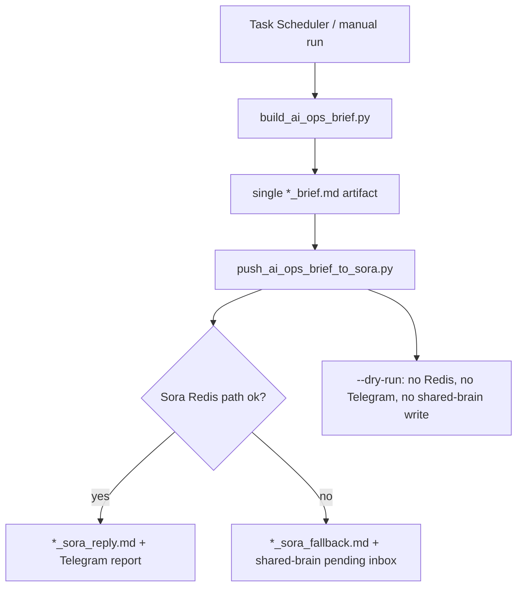
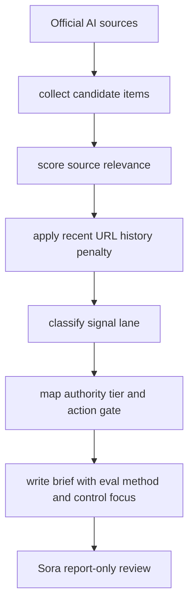

# AI Ops Brief Pipeline Detailed Design v1

> 작성: 2026-04-24 KST, Codex
> 범위: `scripts/build_ai_ops_brief.py`, `scripts/push_ai_ops_brief_to_sora.py`, `scripts/run_ai_ops_brief_pipeline.ps1`

## 1. 목적

AI 관련 공식 소스 수집 결과를 단순 링크 목록이 아니라 대표님의 자동화 환경을 강화하는 운영 브리프로 바꾼다. 이번 패치는 배포나 외부 스케줄 변경 없이 로컬 생성 품질, 중복 저장, Sora 실패 fallback 기록을 개선한다.

## 2. As-Is

- 브리프 생성은 되지만 같은 실행에서 `*_brief.md`가 두 번 저장된다.
- Anthropic 같은 페이지형 소스 제목에 `Product Apr 17...` 같은 노이즈가 섞인다.
- `GPT-5.5 System Card`, `Project Glasswing` 같은 보안/안전 항목이 0점으로 낮게 잡힌다.
- Redis/Sora 경로가 실패하면 오늘처럼 `*_sora_reply.md`가 남지 않아 내부화 실패를 추적하기 어렵다.
- 로컬 검증을 하려면 실제 Sora/Telegram 경로를 건드리게 된다.

## 3. To-Be

## 4. 태스크 보드

| 담당 | 작업 | 선행조건 | 산출물 | 완료 기준 | 검증 |
|---|---|---|---|---|---|
| PM | 보고 목적 재정의 | 기존 산출물 분석 | 운영 브리프 포맷 | `도입/비용/위험/액션` 포함 | 샘플 브리프 확인 |
| Architect | 중복 저장 제거 | push 경로 확인 | 단일 source artifact 재사용 | 1회 실행 1개 원문 저장 | 코드 경로 확인 |
| Developer | 랭킹/제목 정리 | 공식 소스 파싱 | 점수/제목/리스크 로직 | 보안/평가 항목 점수 상승 | 로컬 생성 |
| Ops | 실패 fallback 기록 | Redis 실패 조건 | fallback artifact + inbox | Sora 실패도 추적 가능 | dry-run 및 compile |
| QA | 외부 전송 없는 검증 | `--dry-run` | 테스트 명령 | Telegram/Sora 미호출 | 명령 결과 확인 |

## 5. 사이드이펙트

| 변경 | 영향 | 대응 |
|---|---|---|
| 브리프 포맷 필드 추가 | Sora 프롬프트 입력이 길어짐 | 핵심 필드만 유지, 기존 `###`/`- key:` 구조 유지 |
| 제목/점수 로직 변경 | 기존 점수와 순서가 달라짐 | 보안/평가/자동화 중심 목적에 맞춘 변경 |
| fallback artifact 추가 | 실패 시 파일이 더 생김 | 원문 중복 대신 실패 추적 파일로 분리 |
| shared-brain pending inbox 기록 | Sora 실패가 현재 상태에 남음 | 실패 시에만 기록, dry-run에서는 기록하지 않음 |

## 6. 완료 기준

- Python syntax check 통과
- `build_ai_ops_brief.py --output-file` 로 생성 성공
- 생성 브리프에 `decision`, `risk`, `suggested_action` 포함
- `push_ai_ops_brief_to_sora.py --dry-run --skip-telegram` 이 Redis/Telegram 없이 성공
- 기존 스케줄러 명령은 유지
## 7. 2026-04-24 Execution Update

- Runtime recovery: Redis `localhost:6379`, Brain Worker, Dashboard `:7700`, Cloudflare tunnel, credential watcher, daemon all running after controlled restart.
- Security hardening: Telegram bot-token shaped strings were redacted from existing `logs/*.log*`; current actual-token scan result is `0`.
- Code hardening: daemon logging now installs secret redaction and suppresses noisy `httpx/httpcore` INFO logs; daemon wrapper duplicate detection now ignores ordinary `powershell -Command` launch commands.
- Pipeline validation: `scripts/run_ai_ops_brief_pipeline.ps1` completed successfully at `2026-04-24 13:28:56 KST`.
- Artifacts: `data/automation/ai_ops_brief/20260424_132856_brief.md`, `data/automation/ai_ops_brief/20260424_132856_sora_reply.md`.
- Follow-up patch: Sora brief prompt now forbids question-ending reports and `push_ai_ops_brief_to_sora.py` closes Redis connections after delivery.
- Scheduler: `NeoGenesisDailyAIOpsBrief` is enabled, daily at `09:00`, next run `2026-04-25 09:00 KST`, last result `0`.
- Residual: `NeoGenesisDaemon` task action update requires elevated Task Scheduler permission. Runtime is currently healthy, but the task's stored last result remains `1`; direct invocation of `scripts/start_daemon.ps1` returns exit `0`.

## 8. 2026-04-24 Internalization Design Update

### Trigger

The collected AI ops briefs showed repeated high-signal themes: agent security gates, agent failure diagnostics, and model-routing evaluation. The pipeline should therefore convert collected news into operating metadata, not just a ranked link list.

### Scope

- Local-only code and test changes.
- No scheduler mutation, Telegram send, deploy, credential access, or external side effect.
- Reuse existing `.agent/registries/agent_security_controls.json` G0-G5 authority tiers instead of creating a separate authority model.

### Design

### Added Fields

| Field | Purpose |
|---|---|
| `signal_lane` | Classifies the item as security governance, agent reliability, model routing/eval, runtime cost ops, model watch, or market watch. |
| `authority_tier` | Maps the item to the existing G0-G5 control model. |
| `action_gate` | States the stop condition before external side effects. |
| `control_focus` | Links the item to SEC controls from the agent security registry. |
| `eval_method` | Defines the minimum verification path before internalization. |
| `novelty`, `history_seen_count`, `history_last_seen` | Makes repeated URLs visible and reduces repeat-driven priority inflation. |
| `effective_score` | Score after history penalty; priority is based on this value. |

### Completion Criteria

- Brief generation keeps existing `###` and `- key:` parse shape.
- Repeated URLs from recent artifacts reduce priority unless still fresh/high-signal.
- Sora prompt treats the brief as report-only and requires G4/G5 approval before external actions.
- Dry-run path remains side-effect free.
- Unit tests cover metadata rendering and history dedupe.

### Validation

- `python -m py_compile scripts\build_ai_ops_brief.py scripts\push_ai_ops_brief_to_sora.py tests\core\test_build_ai_ops_brief.py tests\core\test_push_ai_ops_brief_to_sora.py`
- `python -m pytest tests\core\test_build_ai_ops_brief.py tests\core\test_push_ai_ops_brief_to_sora.py -q`
- `python scripts\build_ai_ops_brief.py --limit 8 --output-file data\automation\ai_ops_brief\tmp_internalization_preview_brief.md`
- `python scripts\push_ai_ops_brief_to_sora.py --input-file data\automation\ai_ops_brief\tmp_internalization_preview_brief.md --skip-telegram --dry-run`
- `python scripts\agent_registry_check.py --no-write`
- `python scripts\agent_mcp_policy_check.py --no-write`

Result: all commands passed. The preview artifact was removed after validation.

## 9. 2026-04-24 Approved Live Run

- Approval: owner approved continuing with the previously gated external delivery path.
- Command: `powershell.exe -NoProfile -ExecutionPolicy Bypass -File scripts\run_ai_ops_brief_pipeline.ps1`
- Result: success, exit code `0`.
- Request ID: `req-72cf6d51d711`.
- Brief artifact: `data/automation/ai_ops_brief/20260424_162324_brief.md`.
- Sora reply artifact: `data/automation/ai_ops_brief/20260424_162324_sora_reply.md`.
- Output verification: the generated brief includes `authority_tier`, `action_gate`, `control_focus`, `eval_method`, `novelty`, `history_seen_count`, and `effective_score` fields.
- Delivery behavior: Sora returned a normal report and the pipeline completed without fallback.

### Sora Decision Summary

- Main signal: security governance and verifiable agent execution are the highest-value AI ops themes.
- Immediate action proposed by Sora: strengthen Sora/Codex automation rules with security checklist controls `SEC-002`, `SEC-004`, and `SEC-008` before external API calls.
- Weekly experiments: convert one repeated workflow into a Plan-Execute-Verify loop; add failure-mode regression and model cost/performance evaluation for planning tasks.

## 10. 2026-04-24 SEC-002/004/008 Runtime Gate Implementation

- Scope: local Sora/Codex runtime code only. No deploy, scheduler mutation, credential change, or external notification was performed in this step.
- Added `src/core/governance/execution_gate.py` as the deterministic G0-G5 authority and tool policy gate.
- Brain Worker now evaluates request text before execution, records `security_gate` metadata, and uses ConfirmGate plus Telegram ops approval records for G4/G5 requests.
- Agent Router now filters high-risk tools before Gemini AFC tool execution and prevents filtered tools from re-entering through SoraEngine or image-generation fallback paths.
- Task Planner now evaluates each planned tool before execution and marks blocked steps as failed instead of calling the tool.
- Covered controls: `SEC-002` authority tier mapping, `SEC-004` tool allowlist/denylist, `SEC-008` human approval for external side effects.

### Validation

- `python -m py_compile src\core\governance\execution_gate.py src\core\brain\worker.py src\core\brain\agent_router.py src\core\task_planner.py`
- `python -m pytest tests\core\test_execution_gate.py tests\core\test_build_ai_ops_brief.py tests\core\test_push_ai_ops_brief_to_sora.py -q`
- Result: 15 tests passed.

## 11. 2026-04-24 Approved External Runtime Application

- Approval: owner approved external/operational work after local gate implementation.
- Action taken: restarted Sora Brain Worker only, as the minimum runtime process needed to load the new SEC-002/004/008 gate code.
- Stopped previous worker: PID `68520`.
- Started new worker: PID `105792`.
- Runtime verification: worker reached Redis queue wait state and connected to `redis://***@localhost:6379/0`.
- External work intentionally not performed: no production deploy, no git push, no scheduler mutation, no extra Telegram report run.

## 12. 2026-04-24 Full External Work Follow-up

- Approval: owner requested proceeding with all previously deferred external work.
- Git commit: `a2682bc` (`Document AI ops gate rollout`) added the AI Ops brief builder, pipeline archive wiring, and rollout report.
- Git remote: created private GitHub repo `Yesol-Pilot/neo-genesis`.
- Git push: pushed local `master` to `https://github.com/Yesol-Pilot/neo-genesis.git` and set upstream tracking.
- Scheduler mutation: re-registered Windows Task Scheduler task `NeoGenesisDailyAIOpsBrief` for daily `09:00 KST` execution of `scripts\run_ai_ops_brief_pipeline.ps1`.
- Extra Telegram/Sora report run: completed `scripts\run_ai_ops_brief_pipeline.ps1` with request id `req-1a074ab418b7`.
- New brief artifact: `data/automation/ai_ops_brief/20260424_165313_brief.md`.
- New Sora reply artifact: `data/automation/ai_ops_brief/20260424_165313_sora_reply.md`.
- Production server source upload: uploaded `git archive HEAD` to YSH server and unpacked it into `/home/ysh/sora/build`; verified `src/core/governance/execution_gate.py` is present there.
- Production container replacement: blocked before Docker build/restart because `ysh` is not in the `docker` group and `sudo -n docker ...` returns `sudo: a password is required`.
- Security decision: did not embed or echo a sudo password in shell commands. Full container deploy still requires a noninteractive sudo credential path or an interactive owner-side sudo session.

## 13. 2026-04-24 Sudo/Docker Resolution and Production Hotfix

- Owner request: resolve the sudo/Docker blocker and complete the production runtime application.
- Permission fix: added `ysh` to the server `docker` group via root SSH; a fresh `ysh` SSH session now reports `groups=1001(ysh),990(docker)` and can run `docker ps`.
- Failed full-source image attempt: `sora:v6.5-execgate` failed because `/entrypoint.sh` had CRLF line endings; `sora:v6.5-execgate-r2` fixed the entrypoint but exposed a dashboard auth API drift between `sora_dashboard.py` and `auth_router.py`.
- Safe deployment choice: built `sora:v6.4-healthfix-execgate` from the currently healthy production base image and copied only `execution_gate.py`, `worker.py`, `agent_router.py`, and `task_planner.py`.
- Production replacement: `sora-live` now runs image `sora:v6.4-healthfix-execgate`.
- Runtime verification: Docker health is `healthy`, `/api/status` returns HTTP 200, and the container verifies `deploy_project` as `allowed=True`, `authority_tier=G5`, controls `SEC-002,SEC-004,SEC-008` when owner-approved.
- Rollback retained: previous healthy container is preserved as `sora-live-prev-20260424174235`.
