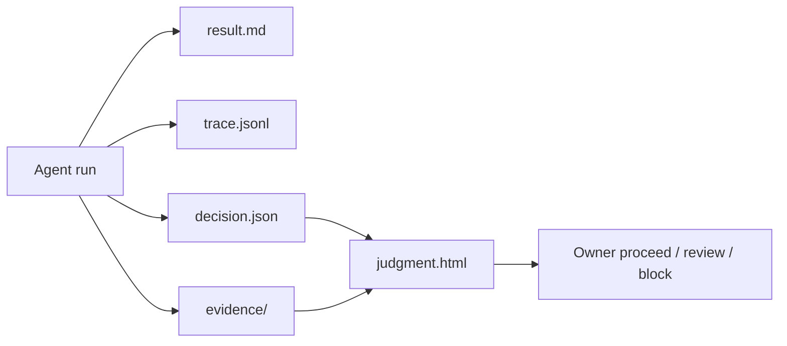

# Judgment Control Tower Plan v1

## Conclusion

Apply the new artifact model as a thin layer over existing Neo Genesis gates:
structured `decision.json` for agents and deterministic `judgment.html` for
owner review. The first integration target is SBU growth because it already has
control tower, regression gate, live smoke, and growth-loop artifacts.

## As-Is

- SBU growth emits Markdown and JSON under `data/sbu-growth/`.
- The regression gate already separates critical issues from warnings.
- Owner review still requires reading long Markdown or raw JSON.
- `.agent/knowledge/agent-environment/` already defines UX, security, eval, and
  workflow principles.

## Target

## Implementation

1. Add `.agent/contracts/AGENT_OUTPUT_ARTIFACT_CONTRACT.md`.
2. Add `.agent/schemas/decision_artifact.schema.json`.
3. Add `scripts/render_judgment_report.py`.
4. Add `src/core/governance/templates/judgment_report.html`.
5. Add `tests/agent_golden/tasks/judgment_v1.json`.
6. Add focused pytest coverage for validation, SBU conversion, and escaping.

## Side Effects

| Change | Side Effect | Mitigation |
|---|---|---|
| New `.agent` contract | Runtime adapters should be regenerated | Run `python scripts/sync_agent_context.py` after the edit |
| HTML report rendering | HTML can be mistaken for canonical source | Contract states HTML is reproducible view only |
| SBU conversion | Existing SBU JSON shape changes could break rendering | Add pytest fixture with minimal SBU shape |
| Owner approval UI | External actions could appear allowed | Approval state remains visible and tiered |

## Success Criteria

- Renderer validates a decision artifact without external dependencies.
- Renderer converts current SBU control tower JSON.
- HTML escapes untrusted input.
- Test coverage passes.
- Runtime adapters are regenerated after `.agent` changes.
