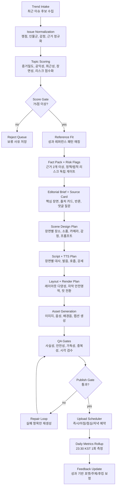

# 올바른 AiNo 레퍼런스 기반 콘텐츠 상세 기획/설계

작성일: 2026-05-28 KST
채널: `올바른 AiNo` / `@leftaino`
상위 문서: `WORKFLOW_DESIGN_SPEC.md`, `PIPELINE_DESIGN.md`, `LEFT_SUPPORT_CONTENT_MASTER_PLAN_20260524.md`
근거 리서치: `output/tiktok_aino_reference_research/20260528_top_performing_political_shortform_references.md`
심층 리서치 의뢰서: `DEEP_RESEARCH_REQUEST_20260528.md`
추가 리서치 의뢰서: `DEEP_RESEARCH_FOLLOWUP_REQUEST_20260528.md`

## 1. 결론

올바른 AiNo는 더 이상 `9장 카드뉴스 자동 생성기`로 설계하면 안 된다. 성과 상위 정치/시사 숏폼의 공통 구조는 카드 수가 아니라 `순간 포착`, `짧은 판정`, `감정이 갈리는 질문`, `댓글에서 싸울 명분`이다.

새 제작 원칙은 다음이다.

1. 주제는 `핫한 키워드`가 아니라 `좌파 지지층이 분노하거나 공유할 이유가 있는 장면`으로 고른다.
2. 각본은 텍스트부터 쓰지 않는다. 먼저 `핵심 장면`, `갈등 축`, `반론`, `판정 기준`, `댓글 선택지`를 만든다.
3. 이미지는 배경이 아니라 증거처럼 보여야 한다. 카드별로 장소, 소품, 카메라 거리, 감정, 증거 오브젝트가 달라야 한다.
4. 포맷은 하나가 아니다. 확산용 20~45초, 수익화용 60~75초, 시리즈형 3부작을 분리한다.
5. 자극성은 필요하지만, 허위사실·실존인물 합성·선거 절차 왜곡·조작된 언론 화면은 금지한다.

## 2. 레퍼런스에서 도출한 성공 문법

### 2.1 성과 상위 패턴

| 패턴 | 대표 레퍼런스 | 성과 신호 | 핵심 구조 | AiNo 변환 |
| --- | --- | --- | --- | --- |
| 결정적 순간 압축 | 짧뉴, JTBC, MBCNEWS | 21~57초 클립, 100만~280만 조회 사례 | 장면 하나를 남기고 설명 제거 | AI 재연 스틸 + 짧은 판정 |
| 재판/국회 사이다 | 애국청년김태풍, 이슈카톡 | 50초 546만 조회, 쇼츠 대량 확산 | 권력자에게 질문이 꽂히는 순간 | 법정/국회 분위기 재구성, 실존 얼굴 없이 책임선 표현 |
| 공식 인물 친근감 | 이재명 TikTok | 4일 10만 팔로워, 7개 445만 조회 | 공식 일정/문서를 플랫폼 장면으로 바꿈 | AiNo 진행자/문서/상황극을 섞어 딱딱함 제거 |
| 경험/증언형 | 한겨레TV, 용혜인 | 구독자 대비 높은 조회와 좋아요율 | 누군가 실제로 겪은 일, 국회 질의 | `이 장면을 시민이 본다면` 관점 추가 |
| 팬덤 결집형 | 김어준, 서울의소리 | 고정 시간, 고정 코너, 강한 분노 | 반복되는 코너 정체성 | `오늘의 판정`, `빈칸 검증`, `댓글 선택` 코너화 |

### 2.2 실패하는 Ai 양산 패턴

- 같은 하단 텍스트 박스 반복.
- 매번 국회 외관, 법봉, 신문 더미, 촛불만 반복.
- 첫 카드가 `OOO 전말`처럼 평면적.
- 카드별 주장 차이가 없고 같은 말을 길게 반복.
- 이미지가 주제와 직접 연결되지 않음.
- TTS가 문장을 읽기만 하고 감정 곡선이 없음.
- 댓글 유도 문구가 `여러분 생각은?` 수준으로 끝남.

## 3. 채널 전략 포지션

### 3.1 한 줄 포지션

`진보 지지층이 공유하고 댓글로 맞붙게 만드는 영화적 정치 쟁점 해설 채널`

### 3.2 시청자 심리

| 시청자 반응 | 콘텐츠가 만들어야 하는 감정 |
| --- | --- |
| "이건 그냥 못 넘기지." | 공정성 침해, 책임 회피 |
| "우파 댓글이 뭐라고 할지 보인다." | 반론 예측, 논쟁 욕구 |
| "이 장면은 저장해야겠다." | 증거감, 기록감 |
| "다음 편도 봐야겠다." | 미해결 질문, 시리즈 기대 |
| "댓글에서 붙어야겠다." | 양자택일, 진영 충돌 |

### 3.3 말투

허용:

- 단정한 분노
- 냉소적 반문
- 책임 추궁
- 기준 제시
- 반론 선제 제시

금지:

- 욕설 중심 조롱
- 미확인 범죄 단정
- 실존 인물 외모 비하
- 선거 절차/결과 미확인 주장
- 투표 요청 또는 후보 지지/반대 광고 문구

## 4. 콘텐츠 포맷 체계

2026-05-28 Deep Research report review 이후 기본값은 `reward_explainer`보다 더 엄격한 `evidence_briefing_75`로 둔다. 짧고 자극적인 영상은 유입에는 유리하지만, 공익/정치 이슈에서는 장기 수익화, 플랫폼 신뢰, AIGC/선거 무결성 리스크가 함께 커진다.

### 4.0 기본 포맷: 증거형 `evidence_briefing_75`

목적: TikTok 발견성, YouTube Shorts 축적, 출처 기반 신뢰, 60초 이상 수익화 후보.

| 항목 | 기준 |
| --- | --- |
| 길이 | 60~80초 |
| 장면 수 | 8~10장 |
| 첫 3초 | 쟁점의 핵심 모순을 한 문장으로 선언 |
| 3~12초 | 기관명/문서명/시점이 보이는 `source_card` 노출 |
| 12~45초 | 근거 문서 1~2개와 반론/맥락 |
| 45~60초 | 제도/생활/책임선 의미 |
| 60~80초 | 한 줄 결론 + 저장/다음 영상 연결 |
| 필수 | `fact_pack` 2개 이상 근거, `risk_flags` 통과, AI/출처/정정 메타데이터 |

이 포맷이 기본값이다. `moment_short`는 증거가 약한 주제를 억지로 짧게 만드는 용도가 아니라, 이미 검증된 이슈의 유입용 파생물로만 쓴다.

### 4.1 포맷 A: 확산용 `moment_short`

목적: 신규 유입, 댓글, 공유.

| 항목 | 기준 |
| --- | --- |
| 길이 | 24~45초 |
| 장면 수 | 5~6장 |
| 카드당 시간 | 4~7초 |
| 핵심 | 한 장면, 한 판정, 한 댓글 질문 |
| 권장 주제 | 법정/국회/발언/기업 논란/역사 조롱/정당 프레임 |
| 금지 | 긴 배경 설명, 9장 고정, 복잡한 연표 |

구조:

1. 판정형 훅: "이 장면, 그냥 실수로 넘길 수 있습니까?"
2. 사건 순간: 무엇이 터졌는가.
3. 반론: 상대 진영은 뭐라고 할 것인가.
4. 기준: 판단 기준 하나.
5. 책임선: 누가 설명해야 하는가.
6. 댓글 선택: "1 실수 / 2 책임 회피 / 3 더 봐야 함"

### 4.2 포맷 B: 수익화용 `reward_explainer`

목적: 1분 이상 원본성, 완주율, 검색 가치, Creator Rewards 적합성.

| 항목 | 기준 |
| --- | --- |
| 길이 | 61~75초 |
| 장면 수 | 8~10장 |
| 카드당 시간 | 6~8초 |
| 핵심 | 쟁점 하나를 근거와 반론까지 정리 |
| 권장 주제 | 특검, 재판, 지지율, 정당 전략, 검찰/국회 쟁점 |
| 필수 | 출처 2개 이상, 반론 1개, 미확인 영역 표시 |

구조:

1. 판정형 훅.
2. 왜 지금인가.
3. 확인된 사실.
4. 우파 반론.
5. 빠진 질문.
6. 기준 1.
7. 기준 2.
8. 책임선.
9. 아직 남은 빈칸.
10. 댓글 선택 + 팔로우 이유.

### 4.3 포맷 C: 시리즈형 `three_part_arc`

목적: 계정 정체성, 재방문, 팔로우.

| 편 | 제목 구조 | 기능 |
| --- | --- | --- |
| 1부 | `오늘 터진 장면` | 확산, 첫 댓글 확보 |
| 2부 | `기록으로 보면` | 검색 가치, 저장 유도 |
| 3부 | `댓글이 갈릴 질문` | 재참여, 팔로우 전환 |

시리즈 조건:

- 같은 주제를 반복하지 않는다. 같은 이슈를 `장면`, `기록`, `논쟁`으로 분해한다.
- 썸네일 문구, 이미지 구도, CTA가 모두 달라야 한다.
- 1부 성과가 기준 미달이면 2부/3부 자동 예약을 중단한다.

## 5. 주제 선정 설계

### 5.1 후보 생성

후보는 키워드가 아니라 `issue_cluster`다.

```json
{
  "issue_cluster": "김건희 양평 특혜 첫 공판",
  "entities": ["김건희", "최은순"],
  "institutions": ["법원", "특검"],
  "actions": ["첫 공판", "고함", "해명"],
  "conflict_axis": "특혜 의혹 vs 정치 공세",
  "scene_potential": ["법정 복도", "마이크 앞 기자들", "문서 더미", "방청석 긴장"],
  "comment_split": ["정치보복", "책임추궁", "더 수사해야"]
}
```

### 5.2 점수표

| 점수 항목 | 질문 | 가중치 |
| --- | --- | ---: |
| evidence_density | 출처 2개 이상, 사실/주장 분리, 소스 카드 구성 가능한가 | 30 |
| civic_value | 공익성, 책임성, 제도적 의미가 있는가 | 25 |
| recency | 최근 24~48시간 안에 보도/댓글/검색 신호가 있는가 | 15 |
| visualizability | 문서, 타임라인, 회의장, 뉴스룸, 데이터 카드로 장면화 가능한가 | 15 |
| explainability_75s | 한 주장으로 60~80초 설명이 가능한가 | 10 |
| risk_adjustment | 선거/명예훼손/AIGC/저작권 리스크가 통제 가능한가 | 5 |

점수 해석:

- 80점 이상: 당일 제작 후보.
- 65~79점: 예비 후보, 보조 출처 추가 필요.
- 50~64점: 시리즈 후속 또는 댓글 반응형 후보.
- 49점 이하: 자동 제작 금지.

`left_emotion`과 `comment_conflict`는 폐기하지 않는다. 다만 주제 통과 점수가 아니라 `audience_response` 보조 필드로 낮춘다. 이 값은 제목, 고정 댓글, CTA를 고르는 데만 쓰고, 근거가 약한 이슈를 통과시키는 용도로 쓰지 않는다.

### 5.3 좌파 반응성 세부 기준

가점:

- 권력 남용
- 검찰/사법 책임
- 역사 기억 훼손
- 특권/불공정
- 혐오/극우 프레임
- 민생/노동/교육 피해
- 민주주의 절차 위협

감점:

- 단순 말실수.
- 숫자만 있는 여론조사.
- 출처가 약한 루머.
- 이미지화가 어려운 추상 논쟁.
- 같은 계정에서 이미 다룬 구조.

## 6. 각본 설계

### 6.1 각본 전 필수 브리프

스크립트 생성 전 아래 7개가 채워져야 한다.

```json
{
  "core_scene": "법정 복도에서 기자들이 몰려 있고, 문서철을 든 익명 인물들이 지나간다",
  "one_sentence_thesis": "핵심은 한 사람의 고함이 아니라, 왜 이 사안이 여기까지 왔느냐는 책임선이다.",
  "left_emotion": "책임 회피에 대한 분노",
  "opposition_frame": "정치보복이라는 반론",
  "judgment_standard": "정치보복인지 책임추궁인지는 기록과 절차가 가른다",
  "missing_question": "누가 어떤 결정으로 이익을 봤는가",
  "comment_choice": ["정치보복", "책임추궁", "더 확인"]
}
```

### 6.2 장면별 문장 길이

| 요소 | 확산용 | 수익화용 |
| --- | ---: | ---: |
| 첫 카드 텍스트 | 14~24자 | 14~28자 |
| 일반 카드 제목 | 12~24자 | 12~26자 |
| 본문 | 28~52자 | 42~84자 |
| TTS 한 장면 | 1~2문장 | 2~3문장 |
| CTA | 선택지 2~3개 | 선택지 2~3개 + 팔로우 이유 |

### 6.3 금지 문장

- "완벽하게 정리해드립니다."
- "충격적인 진실."
- "좌파라면 꼭 봐야 합니다."
- "우파는 전부 틀렸습니다."
- "범죄가 확실합니다." 단, 판결/공식 발표가 있을 때만 사실 표현 가능.

### 6.4 권장 문장

- "문제는 OOO가 아닙니다. 빠진 질문은 OOO입니다."
- "반론은 분명 있습니다. 그런데 이 기준을 피할 수는 없습니다."
- "이게 정치보복이라면, 왜 이 기록은 남아 있습니까?"
- "분노보다 먼저 확인할 건 이겁니다."
- "댓글은 갈릴 겁니다. 기준은 하나입니다."

## 7. 이미지/장면 설계

### 7.1 이미지 생성 원칙

이미지는 `실감나는 영화 스틸`이어야 한다. 다만 실존 정치인 얼굴, 정당 로고, 실제 언론 화면처럼 읽히는 가짜 텍스트는 금지한다.

필수 필드:

```json
{
  "scene_role": "evidence",
  "location": "법원 복도",
  "human_presence": "얼굴이 보이지 않는 기자와 관계자 실루엣",
  "foreground_object": "접힌 공판 자료와 녹음기",
  "camera": "낮은 위치의 50mm 다큐멘터리 렌즈",
  "emotion": "긴장, 정적, 질문 직전",
  "light": "차가운 형광등과 강한 그림자",
  "negative": ["실존 정치인 얼굴", "정당 로고", "읽을 수 있는 신문 헤드라인"]
}
```

### 7.2 장면 유형

| 유형 | 쓰는 상황 | 예시 |
| --- | --- | --- |
| courtroom_tension | 재판/수사/특검 | 법정 복도, 재판 자료, 방청석 실루엣 |
| assembly_floor | 국회/입법/청문회 | 마이크, 발언대, 의원석 느낌의 익명 장면 |
| document_receipt | 보도/기록/팩트체크 | 문서철, 형광펜, 타임라인 보드 |
| public_backlash | 기업/역사/소비자 반발 | 텅 빈 매장, 철거된 홍보물, 시민 시선 |
| polling_control_room | 지지율/여론조사 | 숫자판, 그래프 벽, 조용한 회의실 |
| split_argument | 좌우 반론 | 두 개의 조명, 반대 방향 의자, 갈라진 테이블 |
| aino_anchor | 채널 정체성 | AiNo가 자료 앞에 서 있는 익명 진행자 컷 |

### 7.3 반복 금지

한 영상 안에서 금지:

- 같은 location 3회 이상.
- 같은 foreground object 2회 초과.
- 같은 카메라 거리 3회 이상.
- 모든 카드가 어두운 방/문서/하단 텍스트 박스.
- 배경과 본문 의미가 2장 이상 불일치.

## 8. 레이아웃/편집 설계

### 8.1 레이아웃 역할

| 역할 | 레이아웃 | 기능 |
| --- | --- | --- |
| hook | impact_cover | 첫 1초 판정 |
| why_now | top_split | 지금성 설명 |
| evidence | receipt_panel | 근거감 |
| criteria | side_rule | 판단 기준 |
| responsibility | witness_stage | 책임선 |
| verification | bottom_receipt | 남은 빈칸 |
| cta | choice_stack | 댓글 선택 |

### 8.2 영상 리듬

확산용:

- 0~2초: 판정형 훅.
- 2~8초: 장면/사건.
- 8~18초: 반론과 기준.
- 18~30초: 책임선.
- 30~45초: 댓글 선택.

수익화용:

- 0~3초: 판정형 훅.
- 3~15초: 왜 지금.
- 15~35초: 사실/근거.
- 35~50초: 반론/빈칸.
- 50~65초: 기준/책임.
- 65~75초: CTA.

### 8.3 전환 효과

금지:

- 모든 이미지에 지속적인 흔들림.
- 의미 없는 줌인/줌아웃 반복.
- 장면마다 같은 페이드.

권장:

- 사건 순간: 짧은 hard cut.
- 근거 카드: 아주 약한 push-in.
- 기준 카드: 좌우 wipe 또는 split reveal.
- 책임 카드: 정지에 가까운 hold.
- CTA: 선택지 등장만 움직임.

## 9. TTS/오디오 설계

### 9.1 음성 목표

`차분하지만 압박감 있는 뉴스 해설 톤`

과하면 안 되는 것:

- 분노 연기.
- 조롱 섞인 웃음.
- 과장된 유튜버식 샤우팅.

필요한 것:

- 첫 문장 0.5초 빠른 진입.
- 근거 카드에서 속도 살짝 낮춤.
- 반론 문장 앞뒤에 짧은 쉼.
- CTA에서 또렷한 선택지 발음.

### 9.2 TTS 문장 구조

카드 텍스트:

```text
책임선은 흐려지지 않습니다
```

TTS:

```text
이 사안을 단순한 말싸움으로 보면, 핵심이 흐려집니다.
지금 봐야 할 건 누가 어떤 결정에 책임을 져야 하느냐입니다.
```

### 9.3 발음 규칙

- 숫자는 가능하면 한국어 문장으로 풀어 쓴다.
- `5·18`은 `오 일 팔` 또는 `오월 십팔일` 중 문맥별 고정.
- `AI`는 `에이아이`.
- `TikTok`은 `틱톡`.
- `Creator Rewards`는 `크리에이터 리워즈`.
- 해시태그는 TTS에서 읽지 않는다.

## 10. 캡션/제목/댓글 설계

### 10.1 제목

형식:

- `{인물/기관} + {결정적 행위} + {판정/질문}`
- 28자 이내 우선.
- `충격`, `소름`, `대박` 남발 금지.

예시:

- `판사가 물었고, 정적이 왔다`
- `양평 첫 공판, 진짜 질문`
- `지지율보다 무서운 숫자`
- `이게 실수면 왜 지금인가`

### 10.2 캡션

구조:

1. 한 줄 판정.
2. 출처 기반임을 짧게 표시.
3. 댓글 선택지.
4. 팔로우 이유.

예시:

```text
문제는 고함이 아니라 책임선입니다.
공개 보도 기준으로 확인 가능한 부분만 짚었습니다.

댓글로 골라주세요.
1 정치보복
2 책임추궁
3 더 확인

다음 편은 빠진 기록을 보겠습니다.
```

### 10.3 고정 댓글

기능:

- 논쟁 시작.
- 팔로우 전환.
- 다음 편 예고.

예시:

```text
이건 의견이 갈릴 수밖에 없습니다.
그래서 기준을 하나만 묻겠습니다.

정치보복입니까, 책임추궁입니까?
다음 편에서 빠진 기록을 이어 보겠습니다.
```

## 11. 품질 게이트

### 11.1 생성 전 게이트

차단:

- issue_cluster 없음.
- 출처 2개 미만인데 단정형 주장 필요.
- opposition_frame 없음.
- comment_choice 없음.
- scene_potential 4개 미만.
- 최근성 없는 이슈를 핫토픽으로 포장.

### 11.2 스크립트 게이트

차단:

- 첫 카드가 28자 초과.
- 본문 카드 84자 초과.
- 반론이 없는 일방 선전문.
- 같은 문장 구조 3회 이상 반복.
- 사실/주장/의견 구분 실패.

### 11.3 이미지 게이트

차단:

- 실존 정치인 얼굴 생성.
- 정당 로고 생성.
- 가짜 언론/법원/검찰 문서처럼 읽히는 텍스트.
- 한 영상 안 고유 장소 3개 미만.
- 장면과 카드 역할 불일치 2회 이상.
- 로컬 fallback 이미지만 있는 경우.

### 11.4 렌더 게이트

차단:

- 모바일 미리보기에서 텍스트 넘침.
- 고유 레이아웃 5개 미만.
- 하단 TikTok UI safe zone 침범.
- 모든 장면 움직임이 같은 패턴.
- AIGC 고지 누락.

### 11.5 업로드 게이트

차단:

- ElevenLabs TTS 실패 후 fallback 음성.
- 캡션에 허위 단정/명예훼손 리스크.
- 선거 절차·결과 미확인 주장.
- 게시물 제목/해시태그가 최근 7일 내 생성물과 과도하게 유사.

## 12. 산출물 스키마 추가 제안

현재 artifact에 아래 계층을 추가해야 한다.

### 12.1 `reference_fit.json`

```json
{
  "version": "reference_fit_v1",
  "selected_reference_patterns": ["decisive_moment", "comment_split", "receipt_panel"],
  "why_selected": ["legal scene", "strong comment conflict"],
  "avoid_patterns": ["generic_card_news", "symbolic_background_repeat"]
}
```

### 12.2 `issue_brief.json`

```json
{
  "version": "issue_brief_v1",
  "issue_cluster": "...",
  "core_scene": "...",
  "conflict_axis": "...",
  "left_emotion": "...",
  "opposition_frame": "...",
  "judgment_standard": "...",
  "comment_choice": ["...", "...", "..."],
  "safety_notes": []
}
```

### 12.3 `scene_design_plan.json`

```json
{
  "version": "scene_design_plan_v1",
  "scenes": [
    {
      "scene_id": 1,
      "role": "hook",
      "layout_id": "impact_cover",
      "visual_type": "courtroom_tension",
      "location": "법원 복도",
      "foreground_object": "녹음기와 공판 자료",
      "camera": "low angle documentary still",
      "emotion": "정적 직전",
      "text_density": "low"
    }
  ]
}
```

### 12.4 `engagement_design.json`

```json
{
  "version": "engagement_design_v1",
  "comment_trigger": "정치보복 vs 책임추궁",
  "pinned_comment": "...",
  "follow_reason": "다음 편에서 빠진 기록 확인",
  "share_reason": "댓글 논쟁용 기준표"
}
```

## 13. 일일 편성 설계

하루 3개를 모두 같은 정치 해설로 만들면 피로도가 높다.

| 슬롯 | 포맷 | 목적 | 예시 |
| --- | --- | --- | --- |
| 아침 | `moment_short` | 출근길 확산 | 밤사이 터진 재판/발언/논란 |
| 점심 | `reward_explainer` | 검색/완주/수익화 | 특검, 지지율, 법안, 공판 구조 |
| 저녁 | `comment_battle` 또는 시리즈 후속 | 댓글 전쟁/재방문 | 반론 대응, 선택지 투표, 2부 예고 |

예약 기준:

- 1개는 즉시 또는 가장 가까운 고성과 시간.
- 나머지는 08:10, 11:20, 19:30 KST 슬롯.
- 같은 이슈를 하루 2개 이상 쓸 때는 반드시 포맷과 장면 목적이 달라야 한다.

## 14. 성과 측정 설계

반복 측정 금지. 하루 한 번 23:30 KST canonical rollup을 기준으로 한다.

### 14.1 측정 지표

| 계층 | 지표 | 판단 |
| --- | --- | --- |
| 초기 확산 | 2초/5초 유지율, 조회 시작 속도 | 훅/썸네일 성능 |
| 완주 | 평균 시청 시간, 완료율 | 각본/편집 성능 |
| 참여 | 댓글률, 공유율, 저장률, 좋아요율 | 논쟁/가치 성능 |
| 전환 | 팔로우 전환, 프로필 방문 | 채널 정체성 성능 |
| 수익화 | 1분 이상 qualified view, RPM 추정 | Creator Rewards 적합성 |

### 14.2 피드백 반영

- 댓글률 높고 완주 낮음: 훅은 좋지만 중간 구조가 약함. `moment_short`로 줄인다.
- 완주 높고 댓글 낮음: 정보성은 좋지만 논쟁 질문이 약함. CTA와 반론을 강화한다.
- 조회 높고 팔로우 낮음: 시리즈/코너 정체성이 약함. 다음 편 예고를 강화한다.
- 이미지 이탈 의심: 같은 장면 반복 여부와 첫 3초 시각 후킹을 점검한다.

## 15. 구현 백로그

### P0: 즉시 필요

1. `issue_brief` 생성 단계 추가.
2. 주제 점수표를 `evidence_density`, `civic_value`, `recency`, `visualizability`, `explainability_75s`, `risk_adjustment` 중심으로 재정의.
3. `risk_flags.json` 산출물 추가. 선거, AIGC, 명예훼손, 저작권, 정치 주체 수익화 오인 리스크를 독립 게이트로 둔다.
4. `source_card`를 스크립트/스토리보드 필수 입력으로 추가. 60~80초 영상은 첫 12초 안에 출처가 보여야 한다.
5. `reference_fit` 산출물 추가.
6. `scene_design_plan` 산출물 추가.
7. 스크립트 생성 전 `opposition_frame`, `comment_choice`, `core_scene`, `source_card` 필수화.
8. 이미지 프롬프트가 `scene_design_plan`과 `source_card`를 직접 사용하게 변경.
9. 중복 레이아웃 게이트는 이미 반영된 `layout_variety`와 연결 유지.

### P1: 품질 고도화

1. 포맷을 `moment_short`, `reward_explainer`, `three_part_arc`로 재정의.
2. 기존 `growth_short`, `reward_deep`, `debate_followup`과 호환 mapping 추가.
3. TTS 감정 곡선 artifact 추가.
4. 캡션/고정 댓글에 `comment_choice` 자동 반영.
5. 최근 7일 생성물과 제목/장면/CTA 유사도 검사.

### P2: 운영 고도화

1. 시리즈 2부/3부 자동 예약은 1부 성과 확인 후 결정.
2. 계정 정체성 코너별 성과 리포트.
3. 상위 레퍼런스 주기적 재수집.
4. TikTok Studio metrics 캡처가 없으면 account-reference 성과와 실제 게시 성과를 분리 표기.

## 16. 다음 구현 기준

다음 코드 변경은 이 문서 기준으로 한다.

1. 먼저 `issue_brief`, `fact_pack`, `risk_flags`, `reference_fit`을 만들고 manifest에 넣는다.
2. 그 다음 `source_card`와 `scene_design_plan`을 이미지 생성 전 필수 입력으로 둔다.
3. 마지막으로 포맷 라우터를 `evidence_briefing_75/moment_short/timeline_explainer/three_part_arc` 기준으로 확장한다.

이 순서가 중요한 이유는 이미지/레이아웃을 아무리 고쳐도, 주제와 각본의 장면 설계가 약하면 다시 양산형으로 돌아가기 때문이다.

## 17. 실행 플로우 상세 설계

### 17.1 파이프라인 DAG



### 17.2 단계별 입출력

| 단계 | 입력 | 처리 | 출력 | 차단 조건 |
| --- | --- | --- | --- | --- |
| Trend Intake | 뉴스, 검색어, TikTok/Shorts 레퍼런스, 계정 성과 | 최근성, 확산성, 댓글 유발 가능성 후보화 | `trend_candidates.json` | 출처/시간이 불명확한 이슈 |
| Issue Normalization | 후보 이슈 | 핵심 사건, 관련 진영, 분노 포인트, 반론 포인트, 검증 필요 사실 분리 | `issue_brief.json` | 사실과 의견이 분리되지 않음 |
| Topic Scoring | `issue_brief.json` | `evidence_density`, `civic_value`, `recency`, `visualizability`, `explainability_75s`, `risk_adjustment` 점수화 | `topic_score.json` | 총점 75 미만 또는 근거 2개 미만 |
| Reference Fit | 점수 통과 이슈 | 상위 레퍼런스 문법과 포맷 매칭 | `reference_fit.json` | 기존 업로드와 구조/제목/장면이 유사 |
| Fact Pack + Risk Flags | `issue_brief`, source URLs | 근거 2개 이상, 사실/주장 분리, 선거/AIGC/명예훼손/저작권 리스크 검사 | `fact_pack.json`, `risk_flags.json` | 근거 2개 미만 또는 high risk 수동검토 |
| Editorial Brief | `issue_brief`, `reference_fit`, `fact_pack`, `risk_flags` | 한 문장 논지, 첫 장면, 반론, 판정 기준, 댓글 선택지, source card 설계 | `editorial_brief.json` | 말하고 싶은 핵심이 한 문장으로 안 떨어짐 |
| Scene Design | `editorial_brief` | 카드/컷별 장소, 인물 실루엣, 소품, 감정, 카메라 거리, 색감 지정 | `scene_design_plan.json` | 추상 상징 이미지가 40% 초과 |
| Script + TTS | 장면 설계 | 장면별 6~12초 대사, 한국어 발음 표기, 호흡점, 강세 설계 | `voice_script.json` | 한 컷 자막 2줄 초과 또는 발음 난해 |
| Layout + Render | 장면/대사 | 레이아웃 ID, 자막 안전영역, 전환 방식, 정지 이미지 흔들림 방지 | `render_plan.json` | 같은 레이아웃 3회 연속 |
| QA Gates | 렌더 결과물 | 모바일 가독성, 텍스트 넘침, 이미지-대사 일치, AIGC 표시, 중복성 검사 | `qa_report.json` | 텍스트 overflow, 실존 인물 오인, 허위 근거 |
| Upload Scheduler | 통과 영상 | 즉시 업로드 1개 + 나머지 KST 아침/점심/저녁 예약 | `publish_manifest.json` | 예약 슬롯/캡션/해시태그 누락 |
| Metrics Rollup | TikTok Studio 캡처 | 하루 1회 23:30 KST 기준 성과 수집 | `daily_rollup.json` | 예약 글의 0 metric은 `scheduled_not_evaluable` |

### 17.3 자동화 판단 규칙

1. 주제는 고정 키워드 목록에서 뽑지 않는다. 매 실행마다 증거밀도, 공익성, 최근성, 장면화 가능성, 75초 설명 가능성, 리스크 통제 가능성을 점수화해서 고른다.
2. 같은 이슈를 반복할 수는 있지만, 같은 제목/썸네일/장면/CTA 구조는 반복하지 않는다. 반복 이슈는 반드시 `새로운 장면`, `새로운 반론`, `새로운 질문` 중 2개 이상이 달라야 한다.
3. 이미지는 배경 장식이 아니라 각본의 증거 장면처럼 설계한다. 법원, 국회, 기자회견장, 여론조사 상황실, 문서 검토 장면처럼 대사가 요구하는 공간과 소품을 먼저 정한다.
4. 실존 정치인 얼굴, 정당 로고, 가짜 신문 지면, 가짜 공문 번호처럼 오해 가능한 요소는 직접 생성하지 않는다. 필요한 경우 `해당 이미지는 생성된 이미지입니다` 수준의 짧은 고지를 캡션/영상 내 표시로 처리한다.
5. 기본 포맷은 60~80초 증거형 브리핑이다. 24~45초 확산형은 검증된 이슈의 파생물로 쓰고, 근거 밀도가 부족하면 억지로 1분을 넘기지 않는다.
6. 성과 측정 자동화는 하루 한 번만 실행한다. 업로드 예약 검증과 성과 측정은 다른 작업이며, 예약 상태의 0 metric은 실패 성과로 계산하지 않는다.

### 17.4 구현 단위

| 구현 단위 | 담당 파일 후보 | 완료 기준 |
| --- | --- | --- |
| 이슈 후보 수집기 | `pipeline.py`, `topic_research.py` | 실행마다 `trend_candidates.json` 생성 |
| 주제 점수화 엔진 | `pipeline.py`, `publish_quality_strategy.json` | 점수 근거와 탈락 사유가 manifest에 남음 |
| 레퍼런스 매칭 | `pipeline.py`, `reference_research/*.md` | 포맷 선택 이유가 `reference_fit.json`에 기록 |
| 리스크 플래그 게이트 | `pipeline.py`, `planning_strategy.json` | `risk_flags.json`이 없거나 high risk면 업로드 후보 차단 |
| 소스 카드 생성기 | `pipeline.py`, storyboard config | 첫 12초 안에 표시할 출처 카드가 manifest에 기록 |
| 장면 설계기 | `image_planner.py` 또는 `pipeline.py` | 이미지 프롬프트가 각본 장면에서 파생됨 |
| 레이아웃 라우터 | `pipeline.py`, layout config | 게시물마다 최소 3개 이상 레이아웃 사용 |
| TTS 플래너 | `tts.py`, voice config | 발음/호흡/강세 메타데이터 저장 |
| QA 게이트 | `pipeline.py`, tests | overflow, 중복, AIGC, 장면 일치 실패 시 차단 |
| 스케줄러 | uploader/automation layer | KST 기준 즉시 1개 + 예약 슬롯 manifest 검증 |
| 일일 롤업 | `monitoring.py` | 23:30 KST canonical refresh, 중복 측정 방지 |

## 18. Deep Research Report 반영 결정

검토 문서: `DEEP_RESEARCH_REPORT_REVIEW_20260528.md`  
원문 보고서: `C:\Users\yesol\Downloads\deep-research-report_aino.md`
프로젝트 스냅샷: `output\tiktok_aino_reference_research\deep-research-report_aino_20260528.md`

반영:

- TikTok은 발견성, YouTube Shorts는 축적/수익화, Instagram Reels는 실험/브랜딩 채널로 분리한다.
- 기본 제작 포맷은 `evidence_briefing_75`로 둔다.
- `fact_pack` 다음에 `risk_flags` 독립 게이트를 둔다.
- 60~80초 증거형 영상은 첫 12초 안에 `source_card`를 보여준다.
- 게시 메타데이터에는 AI/출처/정정 루프 표기를 기본값으로 둔다.

유보:

- Google Cloud TTS는 ElevenLabs 대체가 아니라 POC 후보로 둔다. 기존 Anna Kim/ElevenLabs 흐름은 유지하되 같은 대본으로 A/B 비교한다.
- `07:00/12:00/18:00` 편성은 현 운영 슬롯 `08:10/11:20/19:30 KST`를 대체하지 않고 21일 실험 변수로만 둔다.

미완료:

- 보고서는 실제 상위 게시물 20~30개 URL 기반 벤치마크를 제공하지 않았다. 따라서 바이럴 포맷/비주얼 스타일 최적화에는 아직 직접 사용하지 않는다.
- 이 부족분은 `DEEP_RESEARCH_FOLLOWUP_REQUEST_20260528.md`로 재요청한다. URL 기반 게시물 코딩 테이블이 오기 전까지 `reference_patterns.json`, `format_router.json`, `hook_patterns.json`, `scene_type_library.json`, `cta_patterns.json` 확정은 보류한다.

## 19. 추가 보완 보고서 반영 결정

검토 문서: `DEEP_RESEARCH_FOLLOWUP_REVIEW_20260528.md`  
원문 보고서: `C:\Users\yesol\Downloads\deep-research-reportaino2.md`  
프로젝트 스냅샷: `output\tiktok_aino_reference_research\deep-research-reportaino2_20260528.md`

결론:

- 2차 보완 보고서도 최종 레퍼런스 벤치마크로는 불합격이다.
- 보고서가 스스로 20~30개 실제 게시물 URL 전수 코딩표를 완성하지 못했다고 명시했다.
- 따라서 최종 `reference_patterns.json`, `format_router.json`, `hook_patterns.json`, `scene_type_library.json`, `cta_patterns.json`는 계속 보류한다.

반영:

- `config/reference_codebook_provisional.json`을 비활성 임시 코드북으로 추가한다.
- `evidence_briefing`, `hybrid_live_to_short`, `timeline_explainer`, `fact_check`를 우선 참고 포맷으로 둔다.
- 첫 0~5초 안에 장면, 출처, 날짜, 장소, 사건명, 공적 의미 중 최소 2개를 노출하는 규칙을 유지한다.
- 댓글 배틀과 캐릭터 풍자는 독성 댓글, 실존 인물 오인, 출처 없는 범죄 단정 게이트를 통과하지 못하면 생성하지 않는다.

유보:

- 비주얼 스타일, 훅 패턴, CTA 패턴의 최종 자동 라우팅은 URL 기반 실제 게시물 표가 오기 전까지 활성화하지 않는다.
- 보고서 안의 채널/사건 후보는 행 단위 URL이 없으므로 상위 레퍼런스 본표에 넣지 않는다.

다음 요청:

- `DEEP_RESEARCH_URL_BENCHMARK_REQUEST_20260528.md`를 사용한다.
- 20개 미만의 직접 게시물 URL만 확보되면 성공 보고서가 아니라 `FAILED_URL_COLLECTION`으로 처리한다.

## 20. URL 벤치마크 재요청 결과

검토 문서: `DEEP_RESEARCH_URL_BENCHMARK_REVIEW_20260528.md`  
원문 파일: `C:\Users\yesol\Downloads\aino.md`  
프로젝트 스냅샷: `output\tiktok_aino_reference_research\aino_20260528_failed_url_collection.md`

판정:

- 불합격. 파일 최상단에 `FAILED_URL_COLLECTION`이 명시되어 있다.
- 자동 검증 결과 `row_count=10`, TikTok `0`, Instagram Reels `0`, Shorts 직접 URL `0`이다.
- URL 셀에는 Deep Research citation 토큰이 섞여 있고, 일반 YouTube `watch?v=` 링크만 있어 숏폼 벤치마크로 사용할 수 없다.
- first 1s/3s/5s hook, caption density, voice style 등 핵심 코딩 필드가 대부분 `확인 불가`다.

결정:

- 최종 레퍼런스 config 승격은 계속 차단한다.
- 이 파일은 역사/아카이브형 `evidence_briefing` 소재 감각만 참고하고, 포맷 라우터나 훅 점수화에는 사용하지 않는다.
- 다음 수집은 Deep Research 일반론이 아니라 URL-first 방식으로 직접 수집해야 한다.

## 21. URL-First 직접 수집 1차 결과

검토 문서: `URL_FIRST_REFERENCE_COLLECTION_REVIEW_20260529.md`  
벤치마크 후보: `output\tiktok_aino_reference_research\reference_benchmark_url_first_candidate_20260529.md`  
검증 결과: `output\tiktok_aino_reference_research\reference_benchmark_url_first_candidate_20260529.validation.json`  
썸네일 접촉시트: `output\tiktok_aino_reference_research\url_first_collection_20260529\benchmark_thumbnail_contact_sheet.jpg`

판정:

- 구조 검증은 최초 통과했다. `row_count=20`, TikTok `10`, YouTube Shorts `10`, row error `0`.
- 단, first 1s/3s/5s hook과 scene/caption/voice 일부는 전체 재생 검수가 아니라 제목, 메타데이터, 썸네일 접촉시트 기반이다.
- 따라서 최종 config 승격은 아직 보류한다.

사용 가능:

- 주제/출처 적합성 휴리스틱.
- 고관여 정치 키워드와 큰 세로 자막의 패턴 탐색.
- 직접 복제 금지와 증거형 재구성 규칙.

사용 금지:

- `reference_patterns.json`, `format_router.json`, `hook_patterns.json`, `scene_type_library.json`, `cta_patterns.json` 최종 승격.
- 썸네일만 보고 실제 첫 1초 훅이 검증됐다고 간주하는 것.

다음 게이트:

- 20개 중 최소 12개 URL을 실제 재생 검수한다.
- 썸네일과 실제 첫 프레임 차이를 확인한다.
- `thumbnail_metadata_coded` 값을 `playback_verified` 값으로 교체한 뒤 다시 검증한다.

## 22. Playback QA 및 후보 config 생성

검토 문서: `PLAYBACK_QA_REVIEW_20260529.md`  
보강 벤치마크: `output\tiktok_aino_reference_research\reference_benchmark_url_first_playback_verified_20260529.md`  
검증 결과: `output\tiktok_aino_reference_research\reference_benchmark_url_first_playback_verified_20260529.validation.json`  
재생 검수 결과: `output\tiktok_aino_reference_research\playback_qa_20260529\playback_qa_results.json`  
접촉시트: `output\tiktok_aino_reference_research\playback_qa_20260529\playback_qa_1s_contact_sheet_all.jpg`

판정:

- 20행 벤치마크는 재검증 통과. TikTok `10`, YouTube Shorts `10`, row error `0`.
- 16행은 깨끗한 첫 화면 재생 캡처가 확보됐다.
- 4행은 비디오는 로드됐지만 TikTok 앱 열기 또는 경고 모달이 덮여 부분 검수로 분류했다.
- 이 정도면 후보 config 생성은 가능하지만, 아직 production router에 자동 연결하지 않는다.

생성한 후보 config:

- `config/reference_patterns.json`
- `config/format_router.json`
- `config/hook_patterns.json`
- `config/scene_type_library.json`
- `config/cta_patterns.json`

공통 status:

- `candidate_config_ready_not_wired`

핵심 제작 규칙:

- 첫 화면은 `인물/쟁점/숫자/발언/공적 장소` 중 하나를 크게 보여준다.
- 레퍼런스의 공격적 문구는 그대로 복사하지 않고 claim boundary와 source card로 바꾼다.
- 실제 인물 얼굴 합성, 정당 로고, 가짜 뉴스 UI, 가짜 공문서, 출처 없는 범죄 단정은 계속 금지한다.

다음 구현:

- `pipeline.py`가 5개 config를 읽어 `reference_fit.json`, hook plan, scene plan, CTA plan을 만들게 연결한다.
